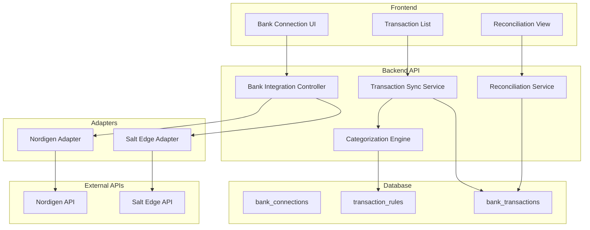

# Bank Integration Research & Design Document

**Created:** 2025-01-21
**Status:** 🔄 IN PROGRESS
**Phase:** 3B - Premium Features

---

## Executive Summary

This document outlines the research, design, and implementation plan for integrating open banking APIs into the DocumentIulia platform. The integration will enable automatic bank transaction synchronization, intelligent categorization, and bank reconciliation features.

---

## API Provider Options

### Option 1: Salt Edge (Recommended)
**Website:** https://www.saltedge.com/
**Pricing:** Tiered based on connections and requests

**Pros:**
- ✅ Excellent coverage of Romanian banks (BCR, BRD, ING, Raiffeisen, etc.)
- ✅ Comprehensive API with transactions, accounts, balances
- ✅ Built-in categorization engine
- ✅ Strong security (PSD2 compliant)
- ✅ Webhooks for real-time updates
- ✅ Well-documented REST API
- ✅ Sandbox environment for testing
- ✅ Multi-currency support

**Cons:**
- ❌ Premium pricing (€0.10-0.50 per connection/month)
- ❌ Requires business account
- ❌ Monthly minimums

**Key Features:**
- Account aggregation (checking, savings, credit cards)
- Transaction history (up to 365 days)
- Balance inquiries
- Transaction categorization (40+ categories)
- Duplicate detection
- Webhooks for new transactions

**API Endpoints:**
```
POST /api/v5/connections - Create bank connection
GET /api/v5/accounts - List accounts
GET /api/v5/transactions - Fetch transactions
GET /api/v5/categories - Get category list
```

---

### Option 2: Nordigen (Free, Open Banking)
**Website:** https://nordigen.com/ (Now part of GoCardless)
**Pricing:** Free tier available (100 connections)

**Pros:**
- ✅ **FREE** for up to 100 bank connections
- ✅ PSD2 compliant open banking
- ✅ Good Romanian bank coverage
- ✅ REST API with OpenAPI spec
- ✅ No monthly fees
- ✅ Simple integration
- ✅ Sandbox environment

**Cons:**
- ❌ No built-in categorization (must implement ourselves)
- ❌ Fewer advanced features vs Salt Edge
- ❌ Limited historical data (90 days standard)
- ❌ No webhooks (must poll API)

**Key Features:**
- Bank account access via PSD2
- Transaction retrieval (90 days)
- Balance checks
- Account details
- Requisition-based flow

**API Endpoints:**
```
POST /api/v2/requisitions/ - Create requisition
GET /api/v2/accounts/{id}/transactions/ - Get transactions
GET /api/v2/accounts/{id}/balances/ - Get balance
GET /api/v2/accounts/{id}/details/ - Get account info
```

---

### Option 3: TrueLayer
**Website:** https://truelayer.com/
**Pricing:** Pay-per-use (£0.02-0.10 per API call)

**Pros:**
- ✅ Strong UK/EU coverage
- ✅ Payment initiation support
- ✅ Real-time data
- ✅ Webhooks

**Cons:**
- ❌ Limited Romanian bank support
- ❌ Per-call pricing can add up
- ❌ Complex pricing model

**Recommendation:** **Not recommended** due to limited Romanian bank coverage.

---

## Recommended Approach: Hybrid Strategy

### Phase 1: Start with Nordigen (Free Tier)
**Rationale:**
- Zero cost for initial rollout
- Test market demand before investing
- Validate integration architecture
- 100 connections = ~100 users (enough for beta)

### Phase 2: Upgrade to Salt Edge (Premium)
**When to upgrade:**
- User base exceeds 100 connections
- Users demand advanced features (categorization, webhooks)
- Revenue justifies premium costs (€0.10/connection = break even at 100 users paying €1/month)

### Implementation Strategy:
- Build abstraction layer for bank integrations
- Support multiple providers with adapter pattern
- Easy switching between Nordigen → Salt Edge

---

## System Architecture

### Component Overview



---

## Database Schema

### Table: bank_connections

Stores user bank account connections.

```sql
CREATE TABLE bank_connections (
    id UUID PRIMARY KEY DEFAULT gen_random_uuid(),
    company_id UUID NOT NULL REFERENCES companies(id) ON DELETE CASCADE,
    user_id UUID NOT NULL REFERENCES users(id) ON DELETE CASCADE,
    provider VARCHAR(50) NOT NULL, -- 'nordigen', 'salt_edge'
    provider_connection_id VARCHAR(255) NOT NULL, -- External ID from provider
    institution_id VARCHAR(255), -- Bank identifier
    institution_name VARCHAR(255), -- Human-readable bank name
    account_id VARCHAR(255), -- External account ID
    account_name VARCHAR(255), -- User-defined nickname
    account_number VARCHAR(100), -- IBAN or account number (last 4 digits only)
    currency VARCHAR(3) DEFAULT 'RON',
    account_type VARCHAR(50), -- 'checking', 'savings', 'credit_card'
    status VARCHAR(50) DEFAULT 'active', -- 'active', 'expired', 'error', 'disconnected'
    access_token TEXT, -- Encrypted token
    refresh_token TEXT, -- Encrypted refresh token
    token_expires_at TIMESTAMP,
    last_sync_at TIMESTAMP,
    consent_expires_at TIMESTAMP, -- PSD2 consent expiry (90 days)
    created_at TIMESTAMP DEFAULT CURRENT_TIMESTAMP,
    updated_at TIMESTAMP DEFAULT CURRENT_TIMESTAMP,
    metadata JSONB, -- Provider-specific data

    UNIQUE(provider, provider_connection_id)
);

CREATE INDEX idx_bank_connections_company ON bank_connections(company_id);
CREATE INDEX idx_bank_connections_user ON bank_connections(user_id);
CREATE INDEX idx_bank_connections_status ON bank_connections(status);
```

### Table: bank_transactions

Stores synchronized bank transactions.

```sql
CREATE TABLE bank_transactions (
    id UUID PRIMARY KEY DEFAULT gen_random_uuid(),
    connection_id UUID NOT NULL REFERENCES bank_connections(id) ON DELETE CASCADE,
    company_id UUID NOT NULL REFERENCES companies(id) ON DELETE CASCADE,
    provider_transaction_id VARCHAR(255) NOT NULL, -- External transaction ID
    transaction_date DATE NOT NULL,
    booking_date DATE, -- When transaction was booked
    value_date DATE, -- When transaction value was applied
    amount DECIMAL(15, 2) NOT NULL,
    currency VARCHAR(3) DEFAULT 'RON',
    description TEXT, -- Original bank description
    clean_description TEXT, -- Cleaned/normalized description
    counterparty_name VARCHAR(255), -- Merchant or recipient
    counterparty_account VARCHAR(100), -- IBAN if available
    category VARCHAR(100), -- Auto-categorized (e.g., 'utilities', 'groceries')
    category_confidence DECIMAL(5, 2), -- 0-100 confidence score
    transaction_type VARCHAR(50), -- 'debit', 'credit', 'fee'
    status VARCHAR(50) DEFAULT 'pending', -- 'pending', 'confirmed', 'matched'
    matched_invoice_id INTEGER REFERENCES invoices(id), -- Linked invoice
    matched_expense_id INTEGER REFERENCES expenses(id), -- Linked expense
    matched_at TIMESTAMP,
    is_duplicate BOOLEAN DEFAULT false,
    duplicate_of UUID REFERENCES bank_transactions(id),
    created_at TIMESTAMP DEFAULT CURRENT_TIMESTAMP,
    updated_at TIMESTAMP DEFAULT CURRENT_TIMESTAMP,
    metadata JSONB, -- Raw provider data

    UNIQUE(connection_id, provider_transaction_id)
);

CREATE INDEX idx_bank_trans_connection ON bank_transactions(connection_id);
CREATE INDEX idx_bank_trans_company ON bank_transactions(company_id);
CREATE INDEX idx_bank_trans_date ON bank_transactions(transaction_date DESC);
CREATE INDEX idx_bank_trans_status ON bank_transactions(status);
CREATE INDEX idx_bank_trans_category ON bank_transactions(category);
CREATE INDEX idx_bank_trans_matched_invoice ON bank_transactions(matched_invoice_id) WHERE matched_invoice_id IS NOT NULL;
CREATE INDEX idx_bank_trans_matched_expense ON bank_transactions(matched_expense_id) WHERE matched_expense_id IS NOT NULL;
```

### Table: transaction_categorization_rules

Stores user-defined and learned categorization rules.

```sql
CREATE TABLE transaction_categorization_rules (
    id SERIAL PRIMARY KEY,
    company_id UUID NOT NULL REFERENCES companies(id) ON DELETE CASCADE,
    rule_type VARCHAR(50) NOT NULL, -- 'keyword', 'amount_range', 'counterparty', 'regex'
    pattern TEXT NOT NULL, -- Matching pattern
    category VARCHAR(100) NOT NULL, -- Target category
    priority INTEGER DEFAULT 100, -- Higher = checked first
    is_active BOOLEAN DEFAULT true,
    is_system_rule BOOLEAN DEFAULT false, -- System vs user-created
    match_count INTEGER DEFAULT 0, -- Times rule matched
    last_matched_at TIMESTAMP,
    created_at TIMESTAMP DEFAULT CURRENT_TIMESTAMP,
    updated_at TIMESTAMP DEFAULT CURRENT_TIMESTAMP
);

CREATE INDEX idx_cat_rules_company ON transaction_categorization_rules(company_id);
CREATE INDEX idx_cat_rules_active ON transaction_categorization_rules(is_active) WHERE is_active = true;
```

### Table: bank_sync_logs

Audit log for synchronization operations.

```sql
CREATE TABLE bank_sync_logs (
    id SERIAL PRIMARY KEY,
    connection_id UUID NOT NULL REFERENCES bank_connections(id) ON DELETE CASCADE,
    sync_type VARCHAR(50) NOT NULL, -- 'manual', 'automatic', 'scheduled'
    status VARCHAR(50) NOT NULL, -- 'started', 'completed', 'failed'
    transactions_fetched INTEGER DEFAULT 0,
    transactions_new INTEGER DEFAULT 0,
    transactions_updated INTEGER DEFAULT 0,
    transactions_skipped INTEGER DEFAULT 0,
    error_message TEXT,
    started_at TIMESTAMP NOT NULL,
    completed_at TIMESTAMP,
    duration_seconds INTEGER, -- Calculated: completed_at - started_at
    metadata JSONB
);

CREATE INDEX idx_sync_logs_connection ON bank_sync_logs(connection_id);
CREATE INDEX idx_sync_logs_status ON bank_sync_logs(status);
CREATE INDEX idx_sync_logs_started ON bank_sync_logs(started_at DESC);
```

---

## Backend Services

### 1. BankIntegrationService.php

Main service for managing bank connections.

```php
class BankIntegrationService
{
    private $db;
    private $adapters = []; // Provider adapters

    public function __construct()
    {
        $database = Database::getInstance();
        $this->db = $database->getConnection();

        // Register adapters
        $this->adapters['nordigen'] = new NordigenAdapter();
        $this->adapters['salt_edge'] = new SaltEdgeAdapter();
    }

    /**
     * Initiate bank connection flow
     * Returns redirect URL for user to authenticate
     */
    public function initiateConnection($companyId, $userId, $provider, $institutionId)
    {
        $adapter = $this->adapters[$provider];
        $redirectUrl = $adapter->createConnection($userId, $institutionId);

        // Store pending connection in database
        $query = "INSERT INTO bank_connections
                  (company_id, user_id, provider, institution_id, status)
                  VALUES (:company_id, :user_id, :provider, :institution_id, 'pending')
                  RETURNING id";

        $stmt = $this->db->prepare($query);
        $stmt->execute([
            ':company_id' => $companyId,
            ':user_id' => $userId,
            ':provider' => $provider,
            ':institution_id' => $institutionId
        ]);

        $connectionId = $stmt->fetchColumn();

        return [
            'connection_id' => $connectionId,
            'redirect_url' => $redirectUrl
        ];
    }

    /**
     * Complete connection after user authentication
     */
    public function completeConnection($connectionId, $authorizationCode)
    {
        // Get connection details
        $connection = $this->getConnection($connectionId);
        $adapter = $this->adapters[$connection['provider']];

        // Exchange authorization code for access token
        $tokens = $adapter->exchangeToken($authorizationCode);

        // Fetch account details
        $accountDetails = $adapter->getAccountDetails($tokens['access_token']);

        // Update connection
        $query = "UPDATE bank_connections SET
                  provider_connection_id = :provider_connection_id,
                  account_id = :account_id,
                  account_name = :account_name,
                  account_number = :account_number,
                  account_type = :account_type,
                  access_token = :access_token,
                  refresh_token = :refresh_token,
                  token_expires_at = :token_expires_at,
                  consent_expires_at = :consent_expires_at,
                  status = 'active'
                  WHERE id = :connection_id";

        $stmt = $this->db->prepare($query);
        $stmt->execute([
            ':connection_id' => $connectionId,
            ':provider_connection_id' => $accountDetails['id'],
            ':account_id' => $accountDetails['account_id'],
            ':account_name' => $accountDetails['name'],
            ':account_number' => substr($accountDetails['iban'], -4), // Last 4 digits only
            ':account_type' => $accountDetails['type'],
            ':access_token' => $this->encryptToken($tokens['access_token']),
            ':refresh_token' => $this->encryptToken($tokens['refresh_token'] ?? null),
            ':token_expires_at' => date('Y-m-d H:i:s', time() + $tokens['expires_in']),
            ':consent_expires_at' => date('Y-m-d H:i:s', strtotime('+90 days'))
        ]);

        return true;
    }

    /**
     * List all connections for a company
     */
    public function listConnections($companyId)
    {
        $query = "SELECT id, provider, institution_name, account_name,
                  account_number, account_type, currency, status,
                  last_sync_at, consent_expires_at
                  FROM bank_connections
                  WHERE company_id = :company_id
                  ORDER BY created_at DESC";

        $stmt = $this->db->prepare($query);
        $stmt->execute([':company_id' => $companyId]);

        return $stmt->fetchAll(PDO::FETCH_ASSOC);
    }

    /**
     * Disconnect and revoke access
     */
    public function disconnectConnection($connectionId)
    {
        $connection = $this->getConnection($connectionId);
        $adapter = $this->adapters[$connection['provider']];

        // Revoke access at provider
        $adapter->revokeAccess($connection['provider_connection_id']);

        // Update status
        $query = "UPDATE bank_connections SET
                  status = 'disconnected',
                  access_token = NULL,
                  refresh_token = NULL
                  WHERE id = :connection_id";

        $stmt = $this->db->prepare($query);
        $stmt->execute([':connection_id' => $connectionId]);

        return true;
    }

    private function encryptToken($token)
    {
        // TODO: Implement proper encryption (AES-256)
        return base64_encode($token);
    }

    private function decryptToken($encryptedToken)
    {
        // TODO: Implement proper decryption
        return base64_decode($encryptedToken);
    }
}
```

---

### 2. TransactionSyncService.php

Handles fetching and storing bank transactions.

```php
class TransactionSyncService
{
    private $db;
    private $adapters = [];
    private $categorizationEngine;

    /**
     * Sync transactions for a connection
     */
    public function syncTransactions($connectionId, $fromDate = null, $toDate = null)
    {
        // Start sync log
        $syncLogId = $this->startSyncLog($connectionId);

        try {
            $connection = $this->getConnection($connectionId);
            $adapter = $this->adapters[$connection['provider']];

            // Fetch transactions from provider
            $transactions = $adapter->getTransactions(
                $connection['account_id'],
                $this->decryptToken($connection['access_token']),
                $fromDate ?? date('Y-m-d', strtotime('-90 days')),
                $toDate ?? date('Y-m-d')
            );

            $stats = [
                'fetched' => count($transactions),
                'new' => 0,
                'updated' => 0,
                'skipped' => 0
            ];

            foreach ($transactions as $transaction) {
                $result = $this->processTransaction($connection, $transaction);
                $stats[$result]++;
            }

            // Update last_sync_at
            $this->updateLastSync($connectionId);

            // Complete sync log
            $this->completeSyncLog($syncLogId, 'completed', $stats);

            return $stats;

        } catch (Exception $e) {
            $this->completeSyncLog($syncLogId, 'failed', null, $e->getMessage());
            throw $e;
        }
    }

    private function processTransaction($connection, $transactionData)
    {
        // Check if transaction already exists
        $existing = $this->findExistingTransaction(
            $connection['id'],
            $transactionData['id']
        );

        if ($existing) {
            // Update if changed
            if ($this->hasChanged($existing, $transactionData)) {
                $this->updateTransaction($existing['id'], $transactionData);
                return 'updated';
            }
            return 'skipped';
        }

        // Check for duplicates (same amount, date, description)
        $duplicate = $this->findDuplicate(
            $connection['id'],
            $transactionData['date'],
            $transactionData['amount'],
            $transactionData['description']
        );

        // Categorize transaction
        $category = $this->categorizationEngine->categorize(
            $transactionData['description'],
            $transactionData['amount'],
            $transactionData['counterparty']
        );

        // Insert new transaction
        $query = "INSERT INTO bank_transactions (
            connection_id, company_id, provider_transaction_id,
            transaction_date, booking_date, amount, currency,
            description, clean_description, counterparty_name,
            counterparty_account, category, category_confidence,
            transaction_type, is_duplicate, duplicate_of, metadata
        ) VALUES (
            :connection_id, :company_id, :provider_transaction_id,
            :transaction_date, :booking_date, :amount, :currency,
            :description, :clean_description, :counterparty_name,
            :counterparty_account, :category, :category_confidence,
            :transaction_type, :is_duplicate, :duplicate_of, :metadata
        )";

        $stmt = $this->db->prepare($query);
        $stmt->execute([
            ':connection_id' => $connection['id'],
            ':company_id' => $connection['company_id'],
            ':provider_transaction_id' => $transactionData['id'],
            ':transaction_date' => $transactionData['date'],
            ':booking_date' => $transactionData['booking_date'] ?? $transactionData['date'],
            ':amount' => $transactionData['amount'],
            ':currency' => $transactionData['currency'] ?? 'RON',
            ':description' => $transactionData['description'],
            ':clean_description' => $this->cleanDescription($transactionData['description']),
            ':counterparty_name' => $transactionData['counterparty'] ?? null,
            ':counterparty_account' => $transactionData['counterparty_account'] ?? null,
            ':category' => $category['category'],
            ':category_confidence' => $category['confidence'],
            ':transaction_type' => $transactionData['amount'] >= 0 ? 'credit' : 'debit',
            ':is_duplicate' => $duplicate ? true : false,
            ':duplicate_of' => $duplicate ? $duplicate['id'] : null,
            ':metadata' => json_encode($transactionData['raw'])
        ]);

        return 'new';
    }
}
```

---

## Next Steps

1. ✅ Complete API provider research
2. ⏸️ Choose Nordigen as initial provider
3. ⏸️ Implement database schema migrations
4. ⏸️ Build adapter interfaces
5. ⏸️ Develop Nordigen adapter
6. ⏸️ Create backend services
7. ⏸️ Build frontend UI components
8. ⏸️ Implement categorization engine
9. ⏸️ Add reconciliation features
10. ⏸️ Test with sandbox accounts

---

**Document Status:** 🔄 IN PROGRESS - Research Complete, Implementation Pending
**Next Action:** Implement database migrations and adapter interfaces
