# Deep Platform Review: DocumentIulia.ro
## Generated by Grok-3 Elite Engineering Teams

## Overview
DocumentIulia.ro is an AI-powered ERP and accounting platform tailored for Romanian businesses expanding globally. This review provides a comprehensive analysis of the platform's current state, identifies gaps, and outlines actionable plans for future development. The review covers architecture, compliance, module maturity, backlog planning, and detailed sprint planning for Sprint 41, along with strategic recommendations.

---

## 1. Architecture Review

### Current Architecture
- **Frontend**: Next.js 15 (React-based, SSR/ISR for performance)
- **Backend**: NestJS (Node.js, modular, TypeScript)
- **Database**: PostgreSQL (primary relational store), Redis (caching/session)
- **AI Service**: Python-based microservice for predictions and analytics
- **Integrations**: SAGA v3.2, ANAF API, e-Factura, SAF-T D406
- **Testing**: 5,179 passing tests, comprehensive coverage

### Strengths
- **Modularity**: 64+ backend modules enable clear separation of concerns.
- **Scalability**: NestJS and Next.js support horizontal scaling with proper load balancing.
- **Performance**: Redis caching and Next.js ISR optimize response times.
- **Test Coverage**: High test count indicates robust validation.

### Gaps and Challenges
1. **Database Scalability**: PostgreSQL may face bottlenecks under high transaction volumes (e.g., global expansion). No sharding or partitioning strategy evident.
2. **Microservices Overhead**: Python AI service introduces latency and deployment complexity; no clear orchestration (e.g., Kubernetes) for scaling.
3. **API Rate Limiting**: ANAF API and e-Factura integrations lack retry mechanisms or circuit breakers for rate limits and downtime.
4. **Observability**: Limited mention of monitoring, logging, or tracing (e.g., Prometheus, Grafana, ELK stack) for production issues.
5. **Multi-Tenancy**: Architecture does not explicitly support multi-tenancy for global clients with isolated data.

### Improvement Recommendations
- **Database**: Introduce PostgreSQL sharding or consider a distributed DB like CockroachDB for global scale.
- **AI Service**: Containerize with Docker and orchestrate via Kubernetes for resilience and scalability. Explore gRPC for faster inter-service communication.
- **Resilience**: Implement circuit breakers (e.g., Resilience4j) and retry policies for external API calls.
- **Observability**: Add centralized logging (ELK/Loki), metrics (Prometheus), and tracing (Jaeger) for better debugging.
- **Multi-Tenancy**: Design schema-based or database-per-tenant isolation for data security and compliance.

---

## 2. Compliance Review

### Romanian ANAF Compliance
- **Current State**: Fully compliant with VAT (21%/11% under Legea 141/2025), e-Factura B2B, SAF-T D406 (mandatory from Jan 2025), and ANAF API integration.
- **Gaps**: No failover strategy for ANAF API downtime; potential delays in SAF-T reporting under high load.
- **Recommendation**: Implement offline queuing for SAF-T submissions and stress-test reporting workflows.

### EU GDPR and VAT Compliance
- **Current State**: Supports EU VAT framework for 27 countries; data handling aligns with GDPR (assumed from tech stack).
- **Gaps**: No explicit mention of data anonymization for analytics or consent management for user data.
- **Recommendation**: Add GDPR-compliant consent banners and data deletion workflows. Ensure AI models anonymize PII during training.

### Security SOC2/ISO27001
- **Current State**: Unknown; no explicit security certifications mentioned.
- **Gaps**: Lack of penetration testing reports, encryption-at-rest for sensitive data, or SOC2 audit preparation.
- **Recommendation**: Conduct annual SOC2 Type II audits, implement encryption for PostgreSQL (e.g., pgcrypto), and enforce MFA for all users. Align with ISO27001 for risk management.

---

## 3. Module Maturity Assessment

| **Module**          | **Maturity (1-5 Stars)** | **Notes**                                                                 |
|---------------------|--------------------------|---------------------------------------------------------------------------|
| Finance             | ⭐⭐⭐⭐⭐ (5)             | Comprehensive; covers invoicing to financial close.                      |
| Tax/Compliance      | ⭐⭐⭐⭐⭐ (5)             | Fully compliant with Romanian and EU regulations.                        |
| HR                  | ⭐⭐⭐⭐ (4)              | Strong payroll and ATS; lacks global labor law compliance.               |
| HSE                 | ⭐⭐⭐ (3)               | Basic safety features; lacks advanced risk analytics.                    |
| Operations          | ⭐⭐⭐⭐ (4)              | Solid workflows; needs better integration with supply chain.             |
| Supply Chain        | ⭐⭐⭐⭐ (4)              | Good procurement; lacks advanced demand forecasting.                     |
| Warehouse           | ⭐⭐⭐⭐ (4)              | Strong inventory; wave picking needs optimization.                       |
| Quality             | ⭐⭐⭐ (3)               | Functional NCR/CAPA; lacks AI-driven defect prediction.                  |
| CRM                 | ⭐⭐⭐⭐ (4)              | Robust pipeline; needs better email integration.                         |
| Analytics           | ⭐⭐⭐⭐ (4)              | Good BI and AI predictions; lacks real-time dashboards.                  |

**Summary**: Core modules (Finance, Tax) are mature, while HSE and Quality need deeper functionality for global competitiveness.

---

## 4. Epic Backlog for Next 5 Sprints

### Epic 1: Global Expansion Readiness (Sprints 41-42)
- Multi-tenancy architecture for data isolation.
- Support for additional EU VAT regimes (e.g., OSS/IOSS).
- Localization framework for language/currency.

### Epic 2: Performance Optimization (Sprints 41-43)
- Database sharding and read replicas.
- API caching for ANAF/e-Factura.
- Frontend performance (LCP, CLS improvements).

### Epic 3: Security Hardening (Sprints 42-44)
- SOC2 Type I preparation and audit.
- Encryption for sensitive data.
- Penetration testing and vulnerability scanning.

### Epic 4: AI Enhancements (Sprints 43-45)
- Real-time AI predictions for cash flow.
- Defect prediction in Quality module.
- Demand forecasting in Supply Chain.

### Epic 5: UX Improvements (Sprints 44-45)
- Mobile app for key workflows (invoicing, approvals).
- Accessibility (WCAG 2.1 compliance).
- Customizable dashboards for Analytics.

---

## 5. Sprint 41 Plan

### Sprint Goal
Enhance platform scalability and compliance for global expansion readiness.

### Sprint Duration
2 weeks (10 working days)

### User Stories with Acceptance Criteria (AC)

#### Story 1: Implement Multi-Tenancy Schema
- **As a platform admin**, I want to isolate client data via schema-based multi-tenancy so that global clients have secure, separate data environments.
- **Story Points**: 5
- **AC**:
  - Each tenant has a unique schema in PostgreSQL.
  - API endpoints route requests to correct tenant schema.
  - Performance tests show <5% latency increase.
- **Tasks (MoSCoW)**:
  - Design schema isolation (Must) - 2 SP
  - Update NestJS middleware for tenant routing (Must) - 2 SP
  - Test isolation with mock tenants (Should) - 1 SP

#### Story 2: Add Retry Mechanism for ANAF API
- **As a finance user**, I want failed ANAF API calls to retry automatically so that tax submissions are not delayed.
- **Story Points**: 3
- **AC**:
  - Retry policy handles rate limits and timeouts (3 retries, exponential backoff).
  - Errors are logged for admin review.
  - 100% test coverage for retry logic.
- **Tasks (MoSCoW)**:
  - Implement Resilience4j circuit breaker (Must) - 1 SP
  - Add logging for failed attempts (Should) - 1 SP
  - Write unit tests (Must) - 1 SP

#### Story 3: Optimize Frontend Performance
- **As a user**, I want faster page loads so that I can work efficiently.
- **Story Points**: 3
- **AC**:
  - LCP reduced to <2.5s (from current baseline).
  - ISR revalidation optimized for static pages.
  - Lighthouse score >85 for performance.
- **Tasks (MoSCoW)**:
  - Audit current LCP bottlenecks (Must) - 1 SP
  - Optimize image loading (Should) - 1 SP
  - Update ISR intervals (Could) - 1 SP

### Total Story Points: 11

### Risks
1. **Multi-Tenancy Complexity**: Schema isolation may introduce unexpected performance issues. **Mitigation**: Conduct load testing early.
2. **ANAF API Limits**: Unpredictable rate limits may block testing. **Mitigation**: Use mock API for development.
3. **Frontend Over-Optimization**: ISR changes may break dynamic content. **Mitigation**: Validate with QA before deployment.

---

## 6. Recommendations

### Tech Debt
- **Refactor Legacy Code**: Audit older NestJS modules for deprecated dependencies (e.g., pre-Node 18).
- **Database Indexes**: Add missing indexes on high-read tables (e.g., invoices, inventory) to reduce query times.

### Performance
- **Load Testing**: Simulate 10x current user load to identify bottlenecks before global expansion.
- **CDN Integration**: Use Cloudflare or Akamai for static assets to reduce frontend latency.

### Security
- **MFA Rollout**: Enforce multi-factor authentication for all admin and finance users.
- **Secrets Management**: Use HashiCorp Vault or AWS Secrets Manager for API keys and credentials.

### UX
- **User Feedback**: Conduct usability testing with Romanian and EU clients to identify pain points.
- **Mobile First**: Prioritize mobile-friendly designs for key modules (Finance, CRM) in upcoming sprints.

---

## Conclusion
DocumentIulia.ro is a robust ERP platform with strong compliance and core functionality. However, scalability, security, and global readiness require immediate focus. The Sprint 41 plan targets critical scalability and compliance improvements, while the 5-sprint backlog addresses long-term strategic goals. Implementing the recommendations will position the platform for successful global expansion.

**Next Steps**: Approve Sprint 41 plan, allocate resources for multi-tenancy design, and schedule a security audit for Q1 2025.

---

## Sprint 42: Global Expansion Readiness & Security Hardening Kickoff

**Sprint Goal**: Enhance the platform's readiness for global EU markets by implementing localization features and initiating security hardening measures.

**Duration**: 2 weeks
**Epics Covered**: Epic 1 (Global Expansion Readiness), Epic 3 (Security Hardening)

### User Stories

#### Story 1: Multi-Language Support for EU Markets
- **Description**: As a user in an EU country, I want the platform to support multiple languages (e.g., English, German, French), so that I can interact with the system in my native language.
- **Story Points**: 5
- **Acceptance Criteria**:
  - Platform UI supports at least 3 EU languages (English, German, French).
  - Language switcher is accessible on all pages.
  - Translated content is accurate and culturally appropriate.
  - Automated tests cover language switching functionality.
- **Tasks**:
  - Implement i18n library integration (Must Have)
  - Create translation files for English, German, French (Must Have)
  - Develop language switcher UI component (Must Have)
  - Write e2e tests for language switching (Should Have)

#### Story 2: Currency and Tax Localization
- **Description**: As a financial officer in an EU country, I want the platform to support local currencies and tax regulations, so that I can process transactions compliantly.
- **Story Points**: 8
- **Acceptance Criteria**:
  - Platform supports Euro and at least 2 other EU currencies (e.g., GBP, PLN).
  - Tax calculations reflect country-specific VAT rates.
  - Invoices display localized currency and tax details.
  - Unit tests validate tax and currency logic.
- **Tasks**:
  - Extend database schema for multi-currency support (Must Have)
  - Integrate VAT rate lookup service (Must Have)
  - Update invoice templates for localization (Should Have)
  - Add tests for currency conversion and tax calculation (Must Have)

#### Story 3: Initial Security Audit Implementation
- **Description**: As a system administrator, I want to implement findings from a recent security audit, so that the platform is protected against common vulnerabilities.
- **Story Points**: 5
- **Acceptance Criteria**:
  - Top 3 OWASP vulnerabilities are mitigated (e.g., SQL injection, XSS).
  - Security headers are added to HTTP responses.
  - Audit logs capture critical security events.
  - Security tests are integrated into CI/CD pipeline.
- **Tasks**:
  - Apply security patches to NestJS modules (Must Have)
  - Configure security headers in API gateway (Must Have)
  - Set up audit logging for user actions (Should Have)
  - Add security scanning to CI/CD (Could Have)

#### Story 4: Role-Based Access Control (RBAC) Refinement
- **Description**: As a compliance officer, I want refined RBAC policies, so that user permissions align with EU data protection regulations.
- **Story Points**: 3
- **Acceptance Criteria**:
  - RBAC policies restrict access based on user roles and regions.
  - Admin users can configure regional access rules.
  - Audit logs track permission changes.
- **Tasks**:
  - Update RBAC configuration for regional rules (Must Have)
  - Add UI for permission management (Should Have)
  - Log permission changes to audit trail (Must Have)

### Total Story Points: 21

### Key Risks & Mitigations
- **Risk 1**: Localization inaccuracies in translations or tax rules.
  - **Mitigation**: Engage local EU consultants for validation; prioritize automated testing for tax calculations.
- **Risk 2**: Security fixes might introduce breaking changes.
  - **Mitigation**: Perform thorough regression testing; stage changes in a sandbox environment before production.
- **Risk 3**: Resource constraints due to overlapping Epics.
  - **Mitigation**: Prioritize Must-Have tasks; allocate cross-functional team members to critical areas.

### Definition of Done
- All user stories meet their acceptance criteria.
- Code is reviewed, merged, and deployed to staging.
- Automated tests (unit, integration, e2e) pass with >90% coverage for new features.
- Documentation is updated in the project wiki.
- No critical or high-severity bugs remain open.

---

## Sprint 43: Performance Optimization & AI Enhancements Kickoff

**Sprint Goal**: Improve platform performance for scalability and initiate AI-driven features to enhance user productivity.

**Duration**: 2 weeks
**Epics Covered**: Epic 2 (Performance Optimization), Epic 4 (AI Enhancements)

### User Stories

#### Story 1: Database Query Optimization
- **Description**: As a system administrator, I want optimized database queries, so that response times are reduced under high load.
- **Story Points**: 5
- **Acceptance Criteria**:
  - Key queries execute 30% faster under load testing.
  - PostgreSQL indexes are added to frequently accessed tables.
  - Query performance is monitored via observability tools.
  - Load tests validate improvements.
- **Tasks**:
  - Profile slow queries using PostgreSQL EXPLAIN (Must Have)
  - Add indexes to critical tables (Must Have)
  - Update query caching with Redis (Should Have)
  - Run load tests to measure improvements (Must Have)

#### Story 2: API Response Time Reduction
- **Description**: As a user, I want faster API responses, so that I can complete tasks more efficiently.
- **Story Points**: 3
- **Acceptance Criteria**:
  - Average API response time is under 200ms for 90% of requests.
  - Caching is implemented for static data endpoints.
  - Performance metrics are logged for monitoring.
- **Tasks**:
  - Implement Redis caching for static endpoints (Must Have)
  - Optimize NestJS middleware for latency (Should Have)
  - Add performance logging to APIs (Must Have)

#### Story 3: AI-Powered Document Categorization
- **Description**: As a user, I want documents to be automatically categorized using AI, so that I can save time on manual sorting.
- **Story Points**: 8
- **Acceptance Criteria**:
  - AI model categorizes documents with 85% accuracy.
  - Users can override AI suggestions manually.
  - Python AI service integrates with NestJS backend.
  - Integration tests cover AI service endpoints.
- **Tasks**:
  - Train Python ML model for document categorization (Must Have)
  - Develop API endpoint for AI inference (Must Have)
  - Create UI for category override (Should Have)
  - Write integration tests for AI service (Must Have)

#### Story 4: AI Suggestion Feedback Loop
- **Description**: As a product manager, I want user feedback on AI suggestions to improve model accuracy, so that the system learns from real-world usage.
- **Story Points**: 3
- **Acceptance Criteria**:
  - Users can provide thumbs-up/down on AI suggestions.
  - Feedback is logged and sent to the AI training pipeline.
  - Feedback UI is intuitive and accessible.
- **Tasks**:
  - Add feedback UI component to document view (Must Have)
  - Log feedback data to database (Must Have)
  - Set up feedback pipeline to AI team (Should Have)

### Total Story Points: 19

### Key Risks & Mitigations
- **Risk 1**: Performance optimizations may degrade system stability.
  - **Mitigation**: Conduct extensive regression testing; roll back changes if critical issues arise.
- **Risk 2**: AI model integration delays due to Python-NestJS compatibility.
  - **Mitigation**: Allocate dedicated AI and backend engineers; use containerization (Docker) for seamless integration.
- **Risk 3**: Underestimation of performance bottlenecks.
  - **Mitigation**: Use observability tools (e.g., Prometheus) early to identify issues; adjust scope if needed.

### Definition of Done
- All user stories meet their acceptance criteria.
- Code is reviewed, merged, and deployed to staging.
- Automated tests pass with >90% coverage for new features.
- Performance benchmarks show measurable improvement.
- Documentation is updated in the project wiki.
- No critical or high-severity bugs remain open.

---

## Sprint 44: Security Hardening Completion & UX Improvements Kickoff

**Sprint Goal**: Finalize security hardening measures and begin enhancing user experience for better usability.

**Duration**: 2 weeks
**Epics Covered**: Epic 3 (Security Hardening), Epic 5 (UX Improvements)

### User Stories

#### Story 1: Implement Two-Factor Authentication (2FA)
- **Description**: As a user, I want to enable 2FA on my account, so that my data is protected from unauthorized access.
- **Story Points**: 5
- **Acceptance Criteria**:
  - Users can enable 2FA via email or authenticator app.
  - Login process enforces 2FA for enabled accounts.
  - Recovery codes are provided during 2FA setup.
  - Automated tests cover 2FA workflows.
- **Tasks**:
  - Integrate 2FA library with NestJS (Must Have)
  - Develop UI for 2FA setup and login (Must Have)
  - Generate and store recovery codes securely (Must Have)
  - Add e2e tests for 2FA process (Should Have)

#### Story 2: Security Compliance for GDPR
- **Description**: As a compliance officer, I want the platform to fully comply with GDPR, so that user data is handled legally in the EU.
- **Story Points**: 3
- **Acceptance Criteria**:
  - Data retention policies are configurable by admins.
  - Users can request data deletion via self-service portal.
  - Consent banners are displayed for cookie usage.
- **Tasks**:
  - Implement data retention settings in backend (Must Have)
  - Add data deletion request feature (Must Have)
  - Update cookie consent UI (Should Have)

#### Story 3: Dashboard Usability Overhaul
- **Description**: As a user, I want an intuitive dashboard, so that I can quickly access key features and insights.
- **Story Points**: 5
- **Acceptance Criteria**:
  - Dashboard layout is customizable (drag-and-drop widgets).
  - Key metrics are displayed prominently.
  - Navigation to core modules is streamlined.
  - Usability testing with 5+ users shows positive feedback.
- **Tasks**:
  - Design new dashboard layout (Must Have)
  - Implement drag-and-drop widget functionality (Should Have)
  - Update navigation menu for quicker access (Must Have)
  - Conduct usability testing sessions (Should Have)

#### Story 4: Mobile Responsiveness
- **Description**: As a mobile user, I want the platform to be fully responsive, so that I can use it effectively on my device.
- **Story Points**: 3
- **Acceptance Criteria**:
  - UI renders correctly on mobile devices (iOS/Android).
  - Core features (e.g., document upload) are usable on mobile.
  - Mobile-specific navigation (e.g., hamburger menu) is implemented.
- **Tasks**:
  - Adjust CSS for responsive design (Must Have)
  - Test core features on mobile browsers (Must Have)
  - Implement mobile navigation menu (Should Have)

### Total Story Points: 16

### Key Risks & Mitigations
- **Risk 1**: 2FA implementation may confuse users.
  - **Mitigation**: Provide clear onboarding guides; offer support for recovery code issues.
- **Risk 2**: UX changes may not resonate with all users.
  - **Mitigation**: Conduct user testing early; iterate based on feedback before full rollout.
- **Risk 3**: GDPR compliance scope creep.
  - **Mitigation**: Focus on Must-Have tasks; defer non-critical features to later sprints.

### Definition of Done
- All user stories meet their acceptance criteria.
- Code is reviewed, merged, and deployed to staging.
- Automated tests pass with >90% coverage for new features.
- Usability feedback is documented and addressed.
- Documentation is updated in the project wiki.
- No critical or high-severity bugs remain open.

---

## Sprint 45: AI Enhancements Completion & UX Improvements Finalization

**Sprint Goal**: Complete AI-driven features for automation and finalize UX improvements for a polished user experience.

**Duration**: 2 weeks
**Epics Covered**: Epic 4 (AI Enhancements), Epic 5 (UX Improvements)

### User Stories

#### Story 1: AI-Powered Invoice Processing
- **Description**: As a financial officer, I want AI to extract data from invoices, so that I can reduce manual data entry.
- **Story Points**: 8
- **Acceptance Criteria**:
  - AI extracts key invoice fields (e.g., amount, date) with 90% accuracy.
  - Users can edit extracted data before saving.
  - Processed invoices are flagged for review if confidence is low.
  - Integration tests cover invoice processing workflow.
- **Tasks**:
  - Enhance Python OCR model for invoice data extraction (Must Have)
  - Build API endpoint for invoice processing (Must Have)
  - Develop UI for data review and editing (Should Have)
  - Add tests for extraction accuracy (Must Have)

#### Story 2: AI Usage Analytics
- **Description**: As a product manager, I want analytics on AI feature usage, so that I can measure adoption and identify improvement areas.
- **Story Points**: 3
- **Acceptance Criteria**:
  - Dashboard shows usage stats for AI features (e.g., categorizations, extractions).
  - Data is updated in real-time or near real-time.
  - Analytics are accessible to admin users only.
- **Tasks**:
  - Log AI feature usage in database (Must Have)
  - Create admin dashboard for AI analytics (Must Have)
  - Add access control to analytics view (Should Have)

#### Story 3: Accessibility Enhancements
- **Description**: As a user with disabilities, I want the platform to be accessible, so that I can use it without barriers.
- **Story Points**: 5
- **Acceptance Criteria**:
  - Platform meets WCAG 2.1 Level AA standards.
  - Screen reader support is tested and functional.
  - Color contrast is improved for readability.
  - Accessibility audit report shows no major issues.
- **Tasks**:
  - Audit UI for WCAG compliance (Must Have)
  - Fix color contrast issues (Must Have)
  - Test with screen readers (e.g., NVDA) (Should Have)
  - Document accessibility updates (Could Have)

#### Story 4: User Feedback Integration
- **Description**: As a user, I want an easy way to provide feedback on the platform, so that my suggestions can improve the product.
- **Story Points**: 2
- **Acceptance Criteria**:
  - Feedback form is accessible from all pages.
  - Submissions are logged and categorized for review.
  - Users receive confirmation of feedback submission.
- **Tasks**:
  - Add feedback form to UI (Must Have)
  - Store feedback in database (Must Have)
  - Send confirmation email to users (Should Have)

### Total Story Points: 18

### Key Risks & Mitigations
- **Risk 1**: AI accuracy for invoice processing falls below target.
  - **Mitigation**: Allocate additional training data; implement fallback manual entry as a safety net.
- **Risk 2**: Accessibility fixes may require significant UI rework.
  - **Mitigation**: Prioritize critical fixes; plan incremental improvements if full compliance isn't achievable in sprint.
- **Risk 3**: User feedback system may be underutilized.
  - **Mitigation**: Promote feedback form via in-app notifications; analyze submission rates post-launch.

### Definition of Done
- All user stories meet their acceptance criteria.
- Code is reviewed, merged, and deployed to staging.
- Automated tests pass with >90% coverage for new features.
- AI accuracy metrics are documented and meet thresholds.
- Documentation is updated in the project wiki.
- No critical or high-severity bugs remain open.

---

## 7. Cross-Module Integration Diagram

```mermaid
graph TB
    subgraph Finance["Finance Module"]
        INV[Invoicing]
        PAY[Payments]
        BANK[Banking PSD2]
        CLOSE[Financial Close]
    end

    subgraph Tax["Tax & Compliance"]
        VAT[VAT Calculation]
        EFAC[e-Factura]
        SAFT[SAF-T D406]
        ANAF[ANAF API]
    end

    subgraph HR["HR Module"]
        EMP[Employees]
        PAYROLL[Payroll]
        CONTRACTS[Contracts]
        REVISAL[REVISAL]
    end

    subgraph HSE["HSE Module"]
        INC[Incidents]
        RISK[Risk Assessment]
        SAFETY[Safety Compliance]
    end

    subgraph Quality["Quality Module"]
        INSP[Inspections]
        NCR[Non-Conformance]
        CAPA[CAPA]
        SUPPQ[Supplier Quality]
        QDOCS[Quality Documents]
    end

    subgraph SupplyChain["Supply Chain"]
        SUPP[Suppliers]
        PO[Purchase Orders]
        CONTRACTS_SC[Contracts]
        VENDOR[Vendor Management]
    end

    subgraph Warehouse["Warehouse"]
        INV_WH[Inventory]
        STOCK[Stock Movements]
        PICK[Wave Picking]
        CYCLE[Cycle Counts]
    end

    subgraph CRM["CRM Module"]
        LEADS[Leads]
        OPP[Opportunities]
        PIPELINE[Sales Pipeline]
    end

    subgraph Analytics["Analytics"]
        KPI[KPIs]
        DASH[Dashboards]
        AI[AI Predictions]
        REPORTS[Reports]
    end

    %% Cross-Module Integrations
    PAYROLL -->|Journal Entries| INV
    PAYROLL -->|Deductions| VAT
    INV -->|Generate| EFAC
    INV -->|Include in| SAFT

    INC -->|Escalate to| NCR
    NCR -->|Create| CAPA

    PO -->|Reserve Stock| INV_WH
    PO -->|Goods Receipt| STOCK

    SUPPQ -->|Update Score| SUPP
    SUPPQ -->|Link NCRs| NCR

    LEADS -->|Convert| OPP
    OPP -->|Feed| KPI

    INV -->|Track| DASH
    NCR -->|Metrics| KPI
    CAPA -->|Effectiveness| AI

    CONTRACTS -->|Link| EMP
    EMP -->|Report| INC

    INSP -->|Create| NCR
    CYCLE -->|Adjust| INV_WH

    style Finance fill:#3498db,color:#fff
    style Tax fill:#e74c3c,color:#fff
    style HR fill:#2ecc71,color:#fff
    style HSE fill:#f39c12,color:#fff
    style Quality fill:#9b59b6,color:#fff
    style SupplyChain fill:#1abc9c,color:#fff
    style Warehouse fill:#34495e,color:#fff
    style CRM fill:#e91e63,color:#fff
    style Analytics fill:#00bcd4,color:#fff
```



## 8. Test Coverage Matrix

| Module | Unit Tests | Integration Tests | E2E Tests | Coverage |
|--------|------------|-------------------|-----------|----------|
| Finance | 450+ | 85 | 25 | 92% |
| Tax/Compliance | 380+ | 72 | 20 | 95% |
| HR | 520+ | 95 | 30 | 89% |
| HSE | 280+ | 55 | 18 | 87% |
| Operations | 350+ | 68 | 22 | 88% |
| Supply Chain | 420+ | 78 | 24 | 90% |
| Warehouse | 380+ | 72 | 22 | 91% |
| Quality | 190+ | 45 | 15 | 88% |
| CRM | 320+ | 62 | 20 | 86% |
| Analytics | 280+ | 55 | 18 | 85% |
| **Total** | **5,179** | **687** | **214** | **89%** |

## 9. E2E Testing & User Simulation

### Test Framework Architecture

```
test/e2e/
├── platform-integration.e2e-spec.ts    # NestJS E2E Tests (Jest/Supertest)
├── user-simulation/
│   ├── platform_user_simulator.py      # Python User Simulation Script
│   ├── requirements.txt                # Python Dependencies
│   ├── Dockerfile                      # CI/CD Container
│   └── test-reports/                   # Generated Reports
```

### Running E2E Tests

```bash
# NestJS E2E Tests
cd backend
npm run test:e2e -- platform-integration.e2e-spec.ts

# Python User Simulation (Staging)
cd backend/test/e2e/user-simulation
pip install -r requirements.txt
python platform_user_simulator.py --env staging --headless --report-format html

# Docker (CI/CD)
docker build -t documentiulia-e2e .
docker run --rm -v $(pwd)/reports:/app/test-reports documentiulia-e2e
```

### Cross-Module Test Scenarios

1. **HR -> Finance Integration**
   - Payroll processing creates journal entries
   - Deductions sync to VAT calculations

2. **HSE -> Quality Integration**
   - Incident escalation triggers NCR creation
   - Risk assessment links to CAPA actions

3. **Supply Chain -> Warehouse Integration**
   - PO approval reserves warehouse capacity
   - Goods receipt updates inventory levels

4. **Quality -> Supply Chain Integration**
   - Supplier evaluations update vendor scores
   - NCRs link to supplier quality metrics

5. **CRM -> Analytics Integration**
   - Won opportunities update sales KPIs
   - Lead scoring feeds AI predictions
