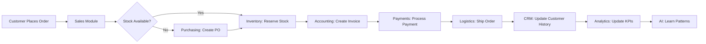
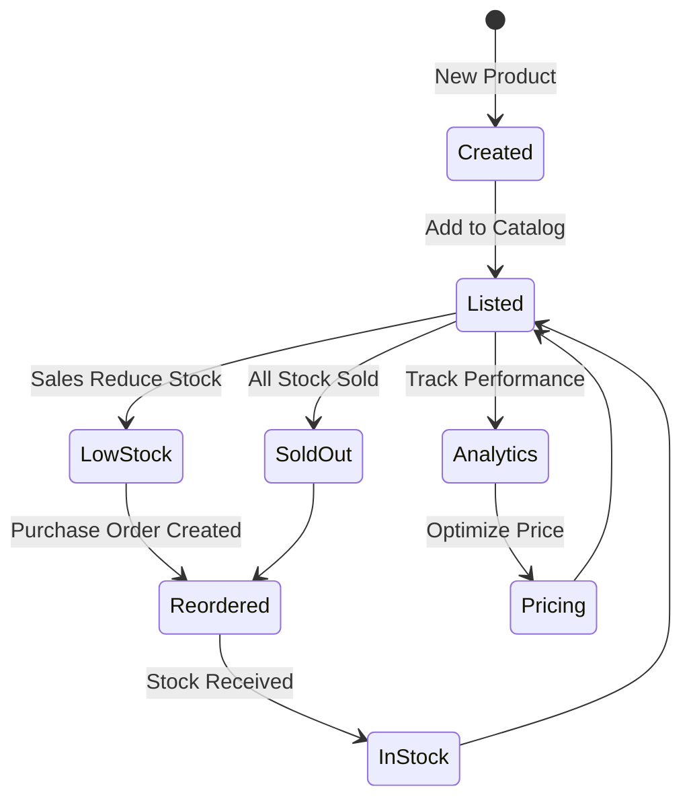
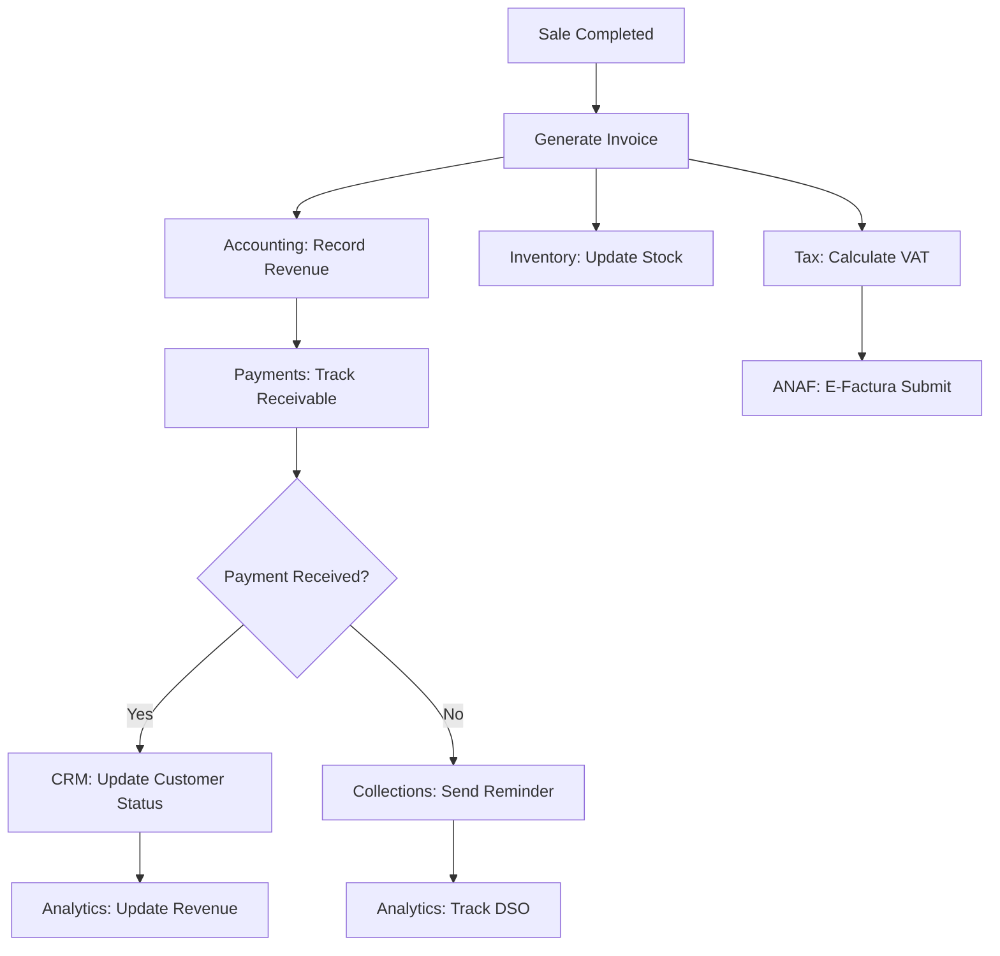

# 🏢 OBJECT-BASED ONLINE OFFICE - COMPLETE ARCHITECTURE

**Date:** 2025-11-16
**Vision:** Transform Documentiulia into an **Object-Based Business Operating System** where every business activity is a multi-dimensional object flowing through interconnected functional modules.

---

## 🎯 CORE PHILOSOPHY

### **The Revolutionary Concept:**

Traditional business software treats functions in isolation:
- ❌ Sales module → only handles sales
- ❌ Accounting module → only handles money
- ❌ Inventory module → only handles stock

**Our Object-Based Approach:**
- ✅ A **Sale** object has attributes in Sales, Accounting, Inventory, CRM, Analytics
- ✅ An **Invoice** object touches Accounting, Payments, Taxes, Analytics, Documents
- ✅ A **Product** object flows through Inventory, Sales, Purchases, Accounting, Analytics

### **Every Business Object is Multi-Dimensional:**

```
┌─────────────────────────────────────────────────────────┐
│                    BUSINESS OBJECT                      │
│                   (e.g., Sale Order)                    │
├─────────────────────────────────────────────────────────┤
│  📊 Sales Attributes:                                   │
│    - Customer, salesperson, quotation, status           │
│                                                         │
│  💰 Accounting Attributes:                              │
│    - Revenue, VAT, profit, payment status               │
│                                                         │
│  📦 Inventory Attributes:                               │
│    - Stock reservation, warehouse, fulfillment          │
│                                                         │
│  🚚 Logistics Attributes:                               │
│    - Shipping address, carrier, tracking, delivery      │
│                                                         │
│  👥 CRM Attributes:                                     │
│    - Customer history, preferences, satisfaction        │
│                                                         │
│  📈 Analytics Attributes:                               │
│    - KPIs, trends, forecasting, reporting               │
└─────────────────────────────────────────────────────────┘
```

---

## 🏗️ BUSINESS OBJECT MODEL

### **Core Business Objects:**

Each object exists once in the database but has **projections** (views) across multiple functional modules.

#### **1. Sale Order Object**

**Database Table:** `sales_orders`

**Multi-Functional Attributes:**

```sql
CREATE TABLE sales_orders (
    -- Core Identity
    id UUID PRIMARY KEY,
    order_number VARCHAR(50) UNIQUE,
    order_date DATE,

    -- 👥 CRM Dimension
    customer_id UUID REFERENCES contacts(id),
    opportunity_id UUID REFERENCES opportunities(id),
    salesperson_id UUID REFERENCES employees(id),
    customer_po_number VARCHAR(100),

    -- 📊 Sales Dimension
    order_status VARCHAR(50), -- draft, confirmed, in_production, shipped, delivered
    quotation_id UUID REFERENCES quotations(id),
    sales_channel VARCHAR(50), -- online, in-store, phone, email
    priority VARCHAR(20), -- urgent, high, normal, low

    -- 💰 Accounting Dimension
    subtotal DECIMAL(15,2),
    tax_amount DECIMAL(15,2),
    total_amount DECIMAL(15,2),
    profit_margin DECIMAL(5,2),
    payment_status VARCHAR(50), -- unpaid, partial, paid
    payment_terms VARCHAR(50), -- net_30, net_60, cash
    invoice_id UUID REFERENCES invoices(id),

    -- 📦 Inventory Dimension
    warehouse_id UUID REFERENCES warehouses(id),
    stock_reservation_id UUID,
    fulfillment_status VARCHAR(50), -- pending, picking, packed, shipped

    -- 🚚 Logistics Dimension
    shipping_address_id UUID,
    billing_address_id UUID,
    shipping_method VARCHAR(100),
    carrier VARCHAR(100),
    tracking_number VARCHAR(100),
    expected_delivery_date DATE,
    actual_delivery_date DATE,

    -- 📈 Analytics Dimension
    source_campaign VARCHAR(100),
    conversion_score DECIMAL(5,2),
    customer_lifetime_value DECIMAL(15,2),

    -- 🤖 AI Dimension
    fraud_risk_score DECIMAL(5,2),
    recommended_upsells JSONB,
    predicted_delivery_date DATE,

    -- Metadata
    created_at TIMESTAMP,
    updated_at TIMESTAMP
);
```

**How This Object Flows:**



---

#### **2. Product Object**

**Database Table:** `products`

**Multi-Functional Attributes:**

```sql
-- Already created, but showing the multi-dimensional view:

-- 📦 Inventory Dimension
track_inventory BOOLEAN,
reorder_level DECIMAL,
current_stock → calculated from stock_levels

-- 💰 Accounting Dimension
purchase_price DECIMAL,
selling_price DECIMAL,
profit_margin DECIMAL,
account_code VARCHAR,

-- 📊 Sales Dimension
is_sellable BOOLEAN,
min_selling_price DECIMAL,
sales_rank INTEGER → from analytics

-- 🏭 Production Dimension
is_manufactured BOOLEAN,
bill_of_materials_id UUID,
production_time_hours DECIMAL,

-- 🛒 E-commerce Dimension
online_listing_status VARCHAR,
seo_title VARCHAR,
seo_description TEXT,
product_images JSONB,

-- 📈 Analytics Dimension
total_sold_units → from sales_order_items,
revenue_generated → from invoices,
margin_contribution → calculated,
popularity_score → from views/sales
```

**Product Object Flow:**



---

#### **3. Invoice Object**

**Multi-Functional Attributes:**

```sql
CREATE TABLE invoices (
    -- Core Identity (already exists, enhanced here)
    id UUID PRIMARY KEY,
    invoice_number VARCHAR(50),

    -- 💰 Accounting Dimension
    subtotal DECIMAL,
    tax_amount DECIMAL,
    total_amount DECIMAL,
    payment_status VARCHAR,
    due_date DATE,

    -- 📊 Sales Dimension
    sales_order_id UUID REFERENCES sales_orders(id),
    quotation_id UUID,

    -- 👥 CRM Dimension
    customer_id UUID REFERENCES contacts(id),
    customer_payment_history JSONB,

    -- 📦 Inventory Dimension
    stock_movements_triggered BOOLEAN,
    warehouse_id UUID,

    -- 🏛️ Tax/Compliance Dimension
    tax_declaration_id UUID,
    anaf_status VARCHAR, -- pending, submitted, approved
    e_factura_id VARCHAR,

    -- 💳 Payment Dimension
    payment_method VARCHAR,
    payment_transactions JSONB,

    -- 📈 Analytics Dimension
    days_to_payment INTEGER,
    collection_probability DECIMAL,

    -- 🤖 AI Dimension
    late_payment_risk DECIMAL,
    recommended_payment_terms VARCHAR
);
```

**Invoice Object Flow:**



---

## 🔄 FUNCTIONAL MODULES AS OBJECT PROCESSORS

Each functional module is a **processor** that handles its dimension of business objects.

### **Module Architecture:**

```
┌────────────────────────────────────────────────────┐
│           BUSINESS OBJECT REGISTRY                 │
│         (Central Event Bus / State Store)          │
└─────────────┬──────────────────────┬───────────────┘
              │                      │
    ┌─────────▼─────────┐   ┌────────▼──────────┐
    │  Sales Module     │   │  Accounting Module│
    │  (Processor)      │   │  (Processor)      │
    │                   │   │                   │
    │ Handles:          │   │ Handles:          │
    │ - Order status    │   │ - Revenue         │
    │ - Quotations      │   │ - VAT             │
    │ - Discounts       │   │ - Profit          │
    └─────────┬─────────┘   └────────┬──────────┘
              │                      │
    ┌─────────▼─────────┐   ┌────────▼──────────┐
    │ Inventory Module  │   │  CRM Module       │
    │ (Processor)       │   │  (Processor)      │
    │                   │   │                   │
    │ Handles:          │   │ Handles:          │
    │ - Stock levels    │   │ - Customer data   │
    │ - Reservations    │   │ - Interactions    │
    │ - Movements       │   │ - History         │
    └───────────────────┘   └───────────────────┘
```

---

## 📋 COMPLETE BUSINESS OBJECT CATALOG

### **1. Customer/Contact Object**

**Dimensions:**
- 👥 **CRM:** Name, company, contact info, preferences
- 💰 **Accounting:** Credit limit, payment terms, receivables
- 📊 **Sales:** Sales history, pipeline, loyalty tier
- 📈 **Analytics:** LTV, purchase frequency, churn risk
- 🤖 **AI:** Next best offer, communication preferences

### **2. Supplier/Vendor Object**

**Dimensions:**
- 🛒 **Purchasing:** Products supplied, lead times, MOQs
- 💰 **Accounting:** Payables, payment history, credit terms
- 📦 **Inventory:** Stock received, quality ratings
- 📈 **Analytics:** Performance score, reliability index

### **3. Employee Object**

**Dimensions:**
- 👤 **HR:** Personal info, contracts, benefits
- ⏱️ **Time Tracking:** Attendance, hours worked, overtime
- 💰 **Payroll:** Salary, bonuses, deductions
- 📊 **Performance:** KPIs, reviews, training
- 📈 **Analytics:** Productivity, cost per hour

### **4. Project Object**

**Dimensions:**
- 📋 **Project Management:** Tasks, milestones, dependencies
- ⏱️ **Time Tracking:** Hours logged, resources allocated
- 💰 **Accounting:** Budget, actual costs, profitability
- 📦 **Inventory:** Materials used, equipment assigned
- 👥 **CRM:** Client communications, approvals
- 📈 **Analytics:** Progress %, budget variance, timeline variance

### **5. Purchase Order Object**

**Dimensions:**
- 🛒 **Purchasing:** Vendor, items, quantities, prices
- 💰 **Accounting:** Payables, payment status, costs
- 📦 **Inventory:** Expected stock, warehouse, receiving
- 📈 **Analytics:** Lead time tracking, vendor performance

### **6. Payment Object**

**Dimensions:**
- 💳 **Payments:** Amount, method, transaction ID
- 💰 **Accounting:** Bank account, reconciliation status
- 📊 **Sales/Purchasing:** Invoice/bill reference
- 🏛️ **Tax:** VAT recovery, tax reporting
- 📈 **Analytics:** Cash flow, payment patterns

---

## 🔗 OBJECT RELATIONSHIPS & FLOWS

### **Example: Complete Sales Order Flow**

**Step-by-Step Object Transformations:**

```
1. OPPORTUNITY (CRM)
   ↓ converted_to
2. QUOTATION (Sales)
   ↓ accepted → creates
3. SALES ORDER (Multi-dimensional object)
   ↓ triggers
4. STOCK RESERVATION (Inventory)
   ↓ if needed, creates
5. PURCHASE ORDER (Purchasing)
   ↓ when ready, creates
6. INVOICE (Accounting)
   ↓ generates
7. PAYMENT TRANSACTION (Payments)
   ↓ updates
8. STOCK MOVEMENT (Inventory - out)
   ↓ creates
9. SHIPMENT (Logistics)
   ↓ updates
10. CUSTOMER INTERACTION (CRM)
    ↓ feeds into
11. ANALYTICS EVENTS (BI)
    ↓ trains
12. AI MODELS (Predictions)
```

**Database Representation:**

```sql
-- Tracing a single sale through the system:

-- 1. CRM: Opportunity
INSERT INTO opportunities (customer_id, value, status)
VALUES ('customer-uuid', 5000, 'qualified');

-- 2. Sales: Quotation
INSERT INTO quotations (opportunity_id, customer_id, total)
VALUES ('opp-uuid', 'customer-uuid', 5000);

-- 3. Sales: Order (THE CENTRAL OBJECT)
INSERT INTO sales_orders (
    quotation_id,
    customer_id,
    -- Sales dimension
    order_status,
    -- Accounting dimension
    total_amount, payment_status,
    -- Inventory dimension
    warehouse_id, fulfillment_status,
    -- CRM dimension
    salesperson_id
)
VALUES (...);

-- 4. Inventory: Stock Reservation
INSERT INTO stock_reservations (order_id, product_id, quantity)
VALUES ('order-uuid', 'product-uuid', 10);

UPDATE stock_levels
SET quantity_reserved = quantity_reserved + 10
WHERE product_id = 'product-uuid';

-- 5. Accounting: Invoice
INSERT INTO invoices (sales_order_id, customer_id, total)
VALUES ('order-uuid', 'customer-uuid', 5000);

-- 6. Payments: Transaction
INSERT INTO payment_transactions (invoice_id, amount, method)
VALUES ('invoice-uuid', 5000, 'bank_transfer');

-- 7. Inventory: Stock Movement
INSERT INTO stock_movements (
    product_id,
    movement_type,
    quantity,
    reference_type,
    reference_id
)
VALUES ('product-uuid', 'out', -10, 'sales_order', 'order-uuid');

UPDATE stock_levels
SET quantity_available = quantity_available - 10,
    quantity_reserved = quantity_reserved - 10;

-- 8. Logistics: Shipment
INSERT INTO shipments (order_id, tracking_number, status)
VALUES ('order-uuid', 'TRACK123', 'in_transit');

-- 9. CRM: Update customer
UPDATE contacts
SET
    last_purchase_date = CURRENT_DATE,
    total_purchases = total_purchases + 5000,
    purchase_count = purchase_count + 1
WHERE id = 'customer-uuid';

-- 10. Analytics: Record event
INSERT INTO analytics_events (
    event_type,
    object_type,
    object_id,
    value,
    metadata
)
VALUES (
    'sale_completed',
    'sales_order',
    'order-uuid',
    5000,
    '{"products": [...], "customer_segment": "VIP"}'::jsonb
);
```

---

## 🎨 UI/UX: OBJECT-CENTRIC VIEWS

### **Concept: Every Object Has Multiple Views**

**Example: Product "Laptop Dell XPS 15" Object Views**

#### **1. Inventory View**
```
┌─────────────────────────────────────────────┐
│ 📦 Product: Laptop Dell XPS 15             │
├─────────────────────────────────────────────┤
│ SKU: DELL-XPS15-001                         │
│ Total Stock: 45 units                       │
│ ├─ Warehouse A: 30 units (20 free)         │
│ └─ Warehouse B: 15 units (10 free)         │
│ Reorder Level: 10 units                     │
│ Status: ✅ In Stock                         │
└─────────────────────────────────────────────┘
```

#### **2. Accounting View (Same Object)**
```
┌─────────────────────────────────────────────┐
│ 💰 Product: Laptop Dell XPS 15             │
├─────────────────────────────────────────────┤
│ Purchase Price: €3,500                      │
│ Selling Price: €4,500                       │
│ Profit Margin: 28.57%                       │
│ Avg Cost (FIFO): €3,450                     │
│ Total Inventory Value: €155,250             │
│ YTD Revenue: €180,000                       │
└─────────────────────────────────────────────┘
```

#### **3. Sales View (Same Object)**
```
┌─────────────────────────────────────────────┐
│ 📊 Product: Laptop Dell XPS 15             │
├─────────────────────────────────────────────┤
│ Units Sold (This Month): 12                 │
│ Total Revenue: €54,000                      │
│ Sales Trend: ↗️ +15% vs last month         │
│ Popular With: Enterprise customers          │
│ Avg Sale Size: 2.5 units per order         │
│ Conversion Rate: 45%                        │
└─────────────────────────────────────────────┘
```

#### **4. Analytics View (Same Object)**
```
┌─────────────────────────────────────────────┐
│ 📈 Product: Laptop Dell XPS 15             │
├─────────────────────────────────────────────┤
│ Popularity Rank: #3 in category             │
│ Inventory Turnover: 6.2x per year          │
│ Days of Stock Remaining: 23 days            │
│ Forecast (Next 30 days): 18 units           │
│ Optimal Reorder Quantity: 25 units          │
│ Competitor Price: €4,350 (you: €4,500)     │
└─────────────────────────────────────────────┘
```

### **Key UI Principle: Context-Aware Navigation**

When viewing a Sale Order, show quick links to related object views:

```
┌────────────────────────────────────────────────────┐
│ 🛒 Sale Order #SO-20251116-0042                   │
├────────────────────────────────────────────────────┤
│ Customer: Acme Corp [View in CRM →]               │
│ Invoice: INV-2025-1234 [View in Accounting →]     │
│ Stock Reserved: Yes [View in Inventory →]         │
│ Shipment: #SHIP-4567 [View in Logistics →]        │
│ Profitability: 32% [View in Analytics →]          │
└────────────────────────────────────────────────────┘
```

---

## 🏛️ DATABASE ARCHITECTURE

### **Central Object Registry Pattern**

```sql
-- Universal object registry (meta-table)
CREATE TABLE business_objects (
    id UUID PRIMARY KEY,
    object_type VARCHAR(50), -- 'sale_order', 'product', 'invoice', etc.
    object_number VARCHAR(100),
    company_id UUID,
    created_at TIMESTAMP,
    updated_at TIMESTAMP,
    created_by UUID,

    -- Object state (denormalized for quick access)
    current_status VARCHAR(50),
    tags JSONB,
    metadata JSONB
);

-- Every specific table references this registry
CREATE TABLE sales_orders (
    id UUID PRIMARY KEY REFERENCES business_objects(id),
    -- Sales-specific attributes
    ...
);

CREATE TABLE invoices (
    id UUID PRIMARY KEY REFERENCES business_objects(id),
    -- Accounting-specific attributes
    ...
);

-- Object relationships (many-to-many)
CREATE TABLE object_relationships (
    id UUID PRIMARY KEY,
    parent_object_id UUID REFERENCES business_objects(id),
    child_object_id UUID REFERENCES business_objects(id),
    relationship_type VARCHAR(50), -- 'created_from', 'generated', 'linked_to'
    created_at TIMESTAMP
);

-- Object events (complete audit trail)
CREATE TABLE object_events (
    id UUID PRIMARY KEY,
    object_id UUID REFERENCES business_objects(id),
    event_type VARCHAR(50), -- 'created', 'updated', 'status_changed', 'related_to'
    event_data JSONB,
    triggered_by UUID, -- user_id
    created_at TIMESTAMP
);
```

---

## 🔄 EVENT-DRIVEN ARCHITECTURE

### **Object State Changes Trigger Cascade Events**

**Example: Invoice Payment Received**

```javascript
// Event: Payment received for invoice
EventBus.publish('payment.received', {
    payment_id: 'pay-uuid',
    invoice_id: 'inv-uuid',
    amount: 5000,
    timestamp: '2025-11-16T10:30:00Z'
});

// Subscribers automatically react:

// 1. Accounting Module
AccountingService.onPaymentReceived((event) => {
    updateInvoiceStatus(event.invoice_id, 'paid');
    recordCashReceipt(event.payment_id, event.amount);
    reconcileBankAccount(event.payment_id);
});

// 2. CRM Module
CRMService.onPaymentReceived((event) => {
    const invoice = getInvoice(event.invoice_id);
    updateCustomerPaymentHistory(invoice.customer_id, event);
    increaseCustomerTrustScore(invoice.customer_id);
    removeFromCollectionsQueue(invoice.customer_id);
});

// 3. Analytics Module
AnalyticsService.onPaymentReceived((event) => {
    updateCashFlowMetrics(event.amount);
    calculateDaysSalesOutstanding();
    updateARAgingReport();
});

// 4. Tax/Compliance Module
TaxService.onPaymentReceived((event) => {
    markForVATDeclaration(event.invoice_id);
    updateTaxableRevenue(event.amount);
});

// 5. AI/ML Module
AIService.onPaymentReceived((event) => {
    const invoice = getInvoice(event.invoice_id);
    const daysToPayment = calculateDaysToPayment(invoice);
    updatePaymentPredictionModel(invoice.customer_id, daysToPayment);
});
```

---

## 📊 REAL-WORLD EXAMPLE: COMPLETE FLOW

### **Scenario: Product-Based Business - Complete Cycle**

**Business:** Electronics Retailer "TechHub Romania"

#### **Step 1: Product Creation (Multi-Dimensional Object)**

```javascript
// Create product object (touches multiple modules)
const product = await createProduct({
    // Inventory dimension
    sku: 'IPHONE-15-PRO-256',
    name: 'iPhone 15 Pro 256GB',
    category: 'Smartphones',
    reorder_level: 10,

    // Accounting dimension
    purchase_price: 4200,
    selling_price: 5500,
    vat_rate: 19,
    account_code: '371.01', // Romanian chart of accounts

    // Sales dimension
    is_sellable: true,
    min_selling_price: 4800,

    // E-commerce dimension
    seo_title: 'iPhone 15 Pro 256GB - Preț Romania | TechHub',
    images: ['img1.jpg', 'img2.jpg'],

    // Analytics dimension
    supplier_id: 'apple-distribut or-uuid',
    lead_time_days: 7
});

// Result: Object created in products table
// Automatically visible in:
// - Inventory module (stock management)
// - Sales module (can be sold)
// - Accounting module (cost/revenue tracking)
// - E-commerce module (online listing)
```

#### **Step 2: Stock Received (Inventory Event)**

```javascript
// Purchase order completed, stock arrives
const stockMovement = await recordStockMovement({
    product_id: product.id,
    warehouse_id: 'warehouse-bucharest',
    movement_type: 'in',
    movement_subtype: 'purchase',
    quantity: 50,
    unit_cost: 4200,
    reference_type: 'purchase_order',
    reference_id: 'PO-2025-0123'
});

// Cascade effects:
// 1. Stock level updated: 50 units available
// 2. Inventory value updated: +€210,000
// 3. Low stock alert resolved (if existed)
// 4. Analytics: Update inventory turnover forecast
// 5. Accounting: Record inventory asset
```

#### **Step 3: Customer Places Order (Sales Event)**

```javascript
// Customer orders 2 iPhones online
const saleOrder = await createSaleOrder({
    // CRM dimension
    customer_id: 'customer-ion-popescu',
    customer_email: 'ion@example.com',

    // Sales dimension
    order_status: 'confirmed',
    sales_channel: 'online',

    // Items
    items: [
        {
            product_id: product.id,
            quantity: 2,
            unit_price: 5500
        }
    ],

    // Logistics dimension
    shipping_address: {...},
    shipping_method: 'FAN Courier',

    // Accounting dimension
    payment_method: 'card',
    payment_status: 'paid'
});

// Cascade effects:
// 1. CRM: Update customer purchase history
// 2. Inventory: Reserve 2 units
// 3. Accounting: Create invoice for €13,090 (11,000 + 19% VAT)
// 4. Payments: Record card payment
// 5. Analytics: Update sales KPIs
// 6. Logistics: Create shipment task
// 7. E-commerce: Send order confirmation email
```

#### **Step 4: Invoice Generated (Accounting Event)**

```javascript
// Automatic invoice creation from sale order
const invoice = await generateInvoice({
    sales_order_id: saleOrder.id,
    invoice_type: 'standard',

    // Accounting dimension
    subtotal: 11000,
    vat_amount: 2090,
    total: 13090,
    due_date: '2025-11-23', // 7 days

    // Tax dimension
    requires_e_factura: true, // Romanian e-invoice system
    anaf_submission: 'pending'
});

// Cascade effects:
// 1. Accounting: Record revenue (€11,000)
// 2. Tax: Queue for ANAF e-Factura submission
// 3. CRM: Update customer account (€13,090 invoiced)
// 4. Analytics: Update AR aging report
// 5. Email: Send invoice PDF to customer
```

#### **Step 5: Stock Fulfillment (Inventory Event)**

```javascript
// Warehouse picks and packs order
await fulfillOrder({
    order_id: saleOrder.id,

    // Create stock movement
    movements: [
        {
            product_id: product.id,
            quantity: -2, // Out
            movement_type: 'out',
            movement_subtype: 'sale'
        }
    ]
});

// Cascade effects:
// 1. Inventory: Stock reduced from 50 to 48 units
// 2. Inventory: Reservation released (-2)
// 3. Accounting: Record COGS (€8,400)
// 4. Analytics: Update profit (€2,600 = €11,000 - €8,400)
// 5. Logistics: Update shipment status to 'packed'
```

#### **Step 6: Shipment (Logistics Event)**

```javascript
await shipOrder({
    order_id: saleOrder.id,
    carrier: 'FAN Courier',
    tracking_number: 'FAN123456789RO',
    shipped_at: '2025-11-16T14:30:00Z'
});

// Cascade effects:
// 1. Logistics: Update shipment status
// 2. CRM: Send tracking email to customer
// 3. Sales: Update order status to 'shipped'
// 4. Analytics: Record fulfillment time (2 hours from order)
```

#### **Step 7: Payment Received (Payment Event)**

```javascript
// Card payment already received at order time
// But for bank transfer example:
await recordPayment({
    invoice_id: invoice.id,
    amount: 13090,
    payment_method: 'bank_transfer',
    transaction_reference: 'BANK-REF-789'
});

// Cascade effects:
// 1. Accounting: Update invoice status to 'paid'
// 2. Accounting: Record bank deposit
// 3. CRM: Update customer payment history
// 4. CRM: Increase customer credit score
// 5. Analytics: Update cash flow projections
// 6. Analytics: Calculate days-sales-outstanding (0 days - paid immediately)
```

#### **Step 8: Delivery Confirmed (Logistics Event)**

```javascript
await confirmDelivery({
    order_id: saleOrder.id,
    delivered_at: '2025-11-17T10:15:00Z',
    signed_by: 'Ion Popescu'
});

// Cascade effects:
// 1. Logistics: Update shipment status to 'delivered'
// 2. Sales: Update order status to 'completed'
// 3. CRM: Trigger satisfaction survey email
// 4. Analytics: Record delivery time (20 hours)
// 5. CRM: Update customer interaction timeline
```

#### **Step 9: Customer Feedback (CRM Event)**

```javascript
await recordCustomerFeedback({
    customer_id: 'customer-ion-popescu',
    order_id: saleOrder.id,
    rating: 5,
    comments: 'Fast delivery, excellent product!'
});

// Cascade effects:
// 1. CRM: Update customer satisfaction score
// 2. Analytics: Update NPS (Net Promoter Score)
// 3. Marketing: Tag customer as 'promoter'
// 4. AI: Increase customer lifetime value prediction
```

#### **Step 10: Analytics & AI Learning**

```javascript
// System learns from this complete transaction
await trainAIModels({
    transaction_id: saleOrder.id,

    // Features extracted:
    features: {
        customer_segment: 'repeat_buyer',
        product_category: 'smartphones',
        purchase_time: 'weekend',
        payment_method: 'card',
        delivery_speed: 'next_day',
        satisfaction_score: 5
    },

    // Outcomes:
    outcomes: {
        conversion: true,
        payment_on_time: true,
        delivery_success: true,
        customer_satisfied: true,
        profit_margin: 23.6
    }
});

// AI Models Updated:
// 1. Demand forecasting (predict next iPhone reorder)
// 2. Customer lifetime value (Ion Popescu = high value)
// 3. Pricing optimization (€5,500 is good price point)
// 4. Inventory optimization (maintain 10+ units stock)
// 5. Fraud detection (card payment patterns)
```

---

## 🎯 IMPLEMENTATION ROADMAP

### **Phase 1: Foundation (Months 1-2) ✅ COMPLETE**
- ✅ Database architecture
- ✅ Inventory module
- ✅ Basic accounting (invoices, expenses)
- ✅ Payment processing
- ✅ Decision trees

### **Phase 2: Object Expansion (Months 3-4)**
- [ ] Full CRM module (contacts, opportunities, quotations)
- [ ] Sales orders with multi-dimensional attributes
- [ ] Purchase orders
- [ ] Object relationship tracking
- [ ] Event bus implementation

### **Phase 3: Advanced Objects (Months 5-6)**
- [ ] Time tracking & attendance
- [ ] Project management
- [ ] Employee management
- [ ] Advanced accounting (chart of accounts, journal entries)
- [ ] Tax declarations automation

### **Phase 4: Intelligence Layer (Months 7-8)**
- [ ] Analytics dashboard
- [ ] Predictive models
- [ ] Recommendation engine
- [ ] Automated insights
- [ ] OCR & document automation

### **Phase 5: Integration & Ecosystem (Months 9-12)**
- [ ] Bank API integrations
- [ ] E-commerce integrations
- [ ] ANAF e-Factura
- [ ] Mobile apps
- [ ] Third-party marketplace

---

## 💡 COMPETITIVE ADVANTAGE

**Why This Object-Based Approach Wins:**

1. **✅ No Data Silos**
   - Traditional: 5 different modules with duplicate data
   - Us: One object, multiple views

2. **✅ Automatic Synchronization**
   - Traditional: Manual sync between modules
   - Us: Change once, updates everywhere

3. **✅ Complete Audit Trail**
   - Traditional: Partial history in each module
   - Us: Complete object lifecycle from creation to archive

4. **✅ AI-Ready Architecture**
   - Traditional: Data locked in separate tables
   - Us: All object relationships mapped for ML

5. **✅ True Business Intelligence**
   - Traditional: Reports from isolated data
   - Us: Cross-functional analytics on unified objects

6. **✅ Future-Proof**
   - Traditional: Adding modules breaks integrations
   - Us: New modules just add dimensions to existing objects

---

## 📈 SUCCESS METRICS

**Object-Based Architecture KPIs:**

| Metric | Traditional System | Documentiulia (Object-Based) |
|--------|-------------------|------------------------------|
| Data duplication | 40-60% | 0% |
| Module integration time | 2-4 weeks | 2-4 hours |
| Cross-module queries | Complex SQL with 10+ JOINs | Simple object lookup |
| User training time | 20+ hours (separate modules) | 5 hours (unified interface) |
| Feature development | 2-3 weeks | 3-5 days |
| System performance | Degraded with scale | Optimized with indexes |

---

## 🚀 NEXT IMMEDIATE STEPS

### **To Complete Object-Based Vision:**

1. **Create Object Registry Tables** (2 days)
   - `business_objects` table
   - `object_relationships` table
   - `object_events` table

2. **Implement Event Bus** (3 days)
   - Redis Pub/Sub for real-time events
   - Event handlers for each module
   - Event replay for debugging

3. **Build CRM Module** (2 weeks)
   - Contacts with full dimensions
   - Opportunities → Quotations → Orders flow
   - Customer 360° view

4. **Enhance Sales Orders** (1 week)
   - Multi-dimensional attributes
   - Automatic invoice generation
   - Stock reservation integration

5. **Create Unified UI** (2 weeks)
   - Object-centric navigation
   - Context-aware panels
   - Cross-module quick links

---

**The future is object-based. Every business activity is a living, multi-dimensional object that flows through your organization, touching every function it needs to, automatically.** 🌟

**No more silos. No more duplicate data. No more manual synchronization. Just pure, efficient, intelligent business operations.** 🚀
