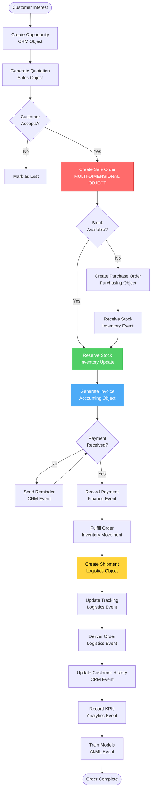
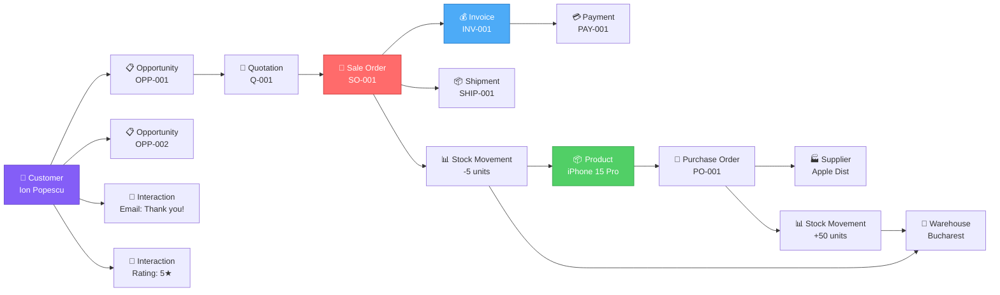
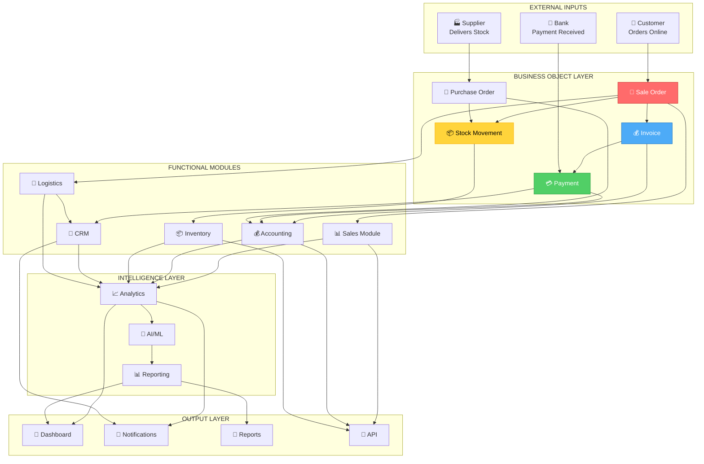
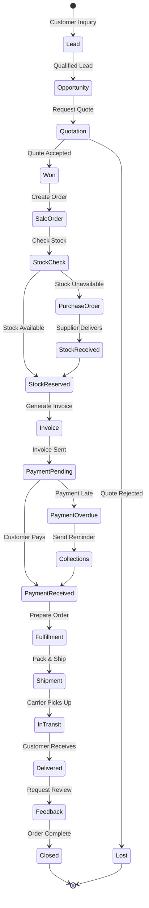

# 🔄 OBJECT-BASED ARCHITECTURE - COMPLETE FLOW DIAGRAMS

## 📊 BUSINESS OBJECT LIFECYCLE

### **Example: Complete Sale Order Flow**



---

## 🎯 MULTI-DIMENSIONAL OBJECT VIEW

### **Sale Order Object - Multiple Projections**

```mermaid
graph TB
    subgraph "CENTRAL OBJECT"
        SO[Sale Order<br/>SO-2025-0042<br/>€13,090]
    end

    subgraph "SALES DIMENSION"
        SO --> S1[Status: Confirmed]
        SO --> S2[Channel: Online]
        SO --> S3[Salesperson: Ana]
        SO --> S4[Quotation: Q-2025-0123]
    end

    subgraph "ACCOUNTING DIMENSION"
        SO --> A1[Revenue: €11,000]
        SO --> A2[VAT: €2,090]
        SO --> A3[Profit: 23.6%]
        SO --> A4[Payment: Paid]
        SO --> A5[Invoice: INV-2025-1234]
    end

    subgraph "INVENTORY DIMENSION"
        SO --> I1[Warehouse: Bucharest]
        SO --> I2[Reserved: 2 units]
        SO --> I3[Fulfillment: Shipped]
        SO --> I4[Stock Movement: -2 iPhone 15]
    end

    subgraph "LOGISTICS DIMENSION"
        SO --> L1[Carrier: FAN Courier]
        SO --> L2[Tracking: FAN123]
        SO --> L3[Delivery: Next Day]
        SO --> L4[Address: Ion Popescu, Bucharest]
    end

    subgraph "CRM DIMENSION"
        SO --> C1[Customer: Ion Popescu]
        SO --> C2[Customer Type: VIP]
        SO --> C3[Purchase #: 5]
        SO --> C4[LTV: €25,000]
    end

    subgraph "ANALYTICS DIMENSION"
        SO --> AN1[Conversion Score: 95%]
        SO --> AN2[Profit Margin: 23.6%]
        SO --> AN3[Fulfillment Time: 2h]
        SO --> AN4[DSO: 0 days]
    end

    style SO fill:#ff6b6b,stroke:#c92a2a,color:#fff,stroke-width:4px
```



---

## 🔗 OBJECT RELATIONSHIP GRAPH

### **How Business Objects Connect**



---

## 🎨 UI/UX OBJECT NAVIGATION

### **Context-Aware Navigation Between Objects**

```
┌─────────────────────────────────────────────────────────┐
│ 🛒 Sale Order #SO-2025-0042                            │
├─────────────────────────────────────────────────────────┤
│                                                         │
│ 📊 SALES VIEW (Current)                                │
│ ├─ Status: Confirmed → Shipped → Delivered             │
│ ├─ Channel: Online Store                               │
│ ├─ Salesperson: Ana Maria                              │
│ └─ Created: 2025-11-16 10:30                          │
│                                                         │
│ 🔗 QUICK LINKS TO OTHER VIEWS:                         │
│                                                         │
│ ┌──────────────┐  ┌──────────────┐  ┌──────────────┐  │
│ │ 💰 Accounting│  │ 📦 Inventory │  │ 👥 CRM       │  │
│ │              │  │              │  │              │  │
│ │ Invoice:     │  │ Stock:       │  │ Customer:    │  │
│ │ INV-2025-1234│  │ Reserved: 2  │  │ Ion Popescu  │  │
│ │              │  │ Warehouse:   │  │ VIP Customer │  │
│ │ Total:       │  │ Bucharest    │  │ LTV: €25K    │  │
│ │ €13,090      │  │              │  │              │  │
│ │ Paid: ✅     │  │ Status: ✅   │  │ Rating: 5★   │  │
│ │              │  │              │  │              │  │
│ │ [View →]     │  │ [View →]     │  │ [View →]     │  │
│ └──────────────┘  └──────────────┘  └──────────────┘  │
│                                                         │
│ ┌──────────────┐  ┌──────────────┐  ┌──────────────┐  │
│ │ 🚚 Logistics │  │ 📈 Analytics │  │ 🤖 AI        │  │
│ │              │  │              │  │              │  │
│ │ Carrier:     │  │ Profit:      │  │ Fraud Risk:  │  │
│ │ FAN Courier  │  │ 23.6%        │  │ Low (2%)     │  │
│ │              │  │              │  │              │  │
│ │ Tracking:    │  │ Conversion:  │  │ Upsell Opp:  │  │
│ │ FAN123456    │  │ 95%          │  │ AirPods Pro  │  │
│ │              │  │              │  │              │  │
│ │ Delivered: ✅│  │ DSO: 0 days  │  │ Confidence:  │  │
│ │              │  │              │  │ 87%          │  │
│ │              │  │              │  │              │  │
│ │ [View →]     │  │ [View →]     │  │ [View →]     │  │
│ └──────────────┘  └──────────────┘  └──────────────┘  │
│                                                         │
│ 📋 RELATED OBJECTS:                                    │
│ ├─ Quotation: Q-2025-0123 [View]                      │
│ ├─ Opportunity: OPP-2025-0089 [View]                  │
│ ├─ Products: iPhone 15 Pro 256GB (×2) [View]          │
│ └─ Payment: PAY-2025-5678 [View]                      │
│                                                         │
│ 📝 ACTIVITY TIMELINE:                                  │
│ ├─ 2025-11-16 10:30 - Order created (by Ana)          │
│ ├─ 2025-11-16 10:31 - Stock reserved (auto)           │
│ ├─ 2025-11-16 10:32 - Invoice generated (auto)        │
│ ├─ 2025-11-16 10:35 - Payment received (card)         │
│ ├─ 2025-11-16 12:45 - Order fulfilled (by Mihai)      │
│ ├─ 2025-11-16 14:30 - Shipment created (auto)         │
│ ├─ 2025-11-17 10:15 - Order delivered (FAN Courier)   │
│ └─ 2025-11-17 14:20 - Customer rated 5★               │
│                                                         │
└─────────────────────────────────────────────────────────┘
```

---

## 🔄 EVENT CASCADE DIAGRAM

### **One Payment Event Triggers Multiple Updates**

```mermaid
graph TB
    Event[💳 Payment Received<br/>€13,090<br/>2025-11-16 10:35]

    Event --> Acc[💰 ACCOUNTING MODULE]
    Event --> CRM[👥 CRM MODULE]
    Event --> Ana[📈 ANALYTICS MODULE]
    Event --> Tax[🏛️ TAX MODULE]
    Event --> AI[🤖 AI MODULE]
    Event --> Email[📧 EMAIL MODULE]

    Acc --> Acc1[✅ Mark invoice as PAID]
    Acc --> Acc2[📊 Record cash receipt]
    Acc --> Acc3[🏦 Update bank balance]

    CRM --> CRM1[📈 Update customer payment history]
    CRM --> CRM2[⭐ Increase trust score]
    CRM --> CRM3[🚫 Remove from collections queue]
    CRM --> CRM4[🏆 Award loyalty points]

    Ana --> Ana1[💰 Update cash flow metrics]
    Ana --> Ana2[📊 Recalculate DSO]
    Ana --> Ana3[📈 Update AR aging report]
    Ana --> Ana4[💵 Update revenue KPIs]

    Tax --> Tax1[📋 Mark for VAT declaration]
    Tax --> Tax2[💰 Update taxable revenue]
    Tax --> Tax3[🏛️ Queue ANAF submission]

    AI --> AI1[🧠 Update payment prediction model]
    AI --> AI2[📊 Calculate payment velocity]
    AI --> AI3[🎯 Adjust customer LTV]

    Email --> Email1[📧 Send payment confirmation]
    Email --> Email2[📄 Attach receipt PDF]

    style Event fill:#ff6b6b,stroke:#c92a2a,color:#fff,stroke-width:4px
    style Acc fill:#4dabf7,stroke:#1971c2,color:#fff
    style CRM fill:#845ef7,stroke:#5f3dc4,color:#fff
    style Ana fill:#51cf66,stroke:#2f9e44,color:#fff
    style Tax fill:#ffd43b,stroke:#fab005,color:#000
    style AI fill:#ff8787,stroke:#fa5252,color:#fff
```



---

## 📦 PRODUCT OBJECT - MULTI-MODULE VIEW

### **One Product, Multiple Functional Perspectives**

```
                    📱 iPhone 15 Pro 256GB
                    SKU: IPHONE-15-PRO-256
                           │
        ┌──────────────────┼──────────────────┐
        │                  │                  │
   ┌────▼────┐       ┌─────▼─────┐      ┌────▼────┐
   │📦 STOCK │       │💰 FINANCE │      │📊 SALES │
   └────┬────┘       └─────┬─────┘      └────┬────┘
        │                  │                  │
   ┌────▼─────────────┐   ┌▼──────────────┐  ┌▼──────────────┐
   │ Warehouse A: 30  │   │ Purchase: €3.5K│  │ Sold: 45 units│
   │ Warehouse B: 15  │   │ Selling: €4.5K │  │ Revenue: €203K│
   │ Total: 45 units  │   │ Margin: 28.5%  │  │ Trend: ↗️ +15%│
   │ Reserved: 10     │   │ Value: €158K   │  │ Rank: #3      │
   │ Free: 35 units   │   │ COGS: €158K    │  │ Conv: 45%     │
   └──────────────────┘   └────────────────┘  └───────────────┘
        │                  │                  │
        └──────────────────┼──────────────────┘
                           │
        ┌──────────────────┼──────────────────┐
        │                  │                  │
   ┌────▼────┐       ┌─────▼─────┐      ┌────▼────┐
   │🛒 PURCH │       │📈 ANALYTI │      │🤖 AI    │
   └────┬────┘       └─────┬─────┘      └────┬────┘
        │                  │                  │
   ┌────▼─────────────┐   ┌▼──────────────┐  ┌▼──────────────┐
   │ Supplier: Apple  │   │ Turnover: 6.2x│  │ Forecast: 18  │
   │ Lead Time: 7 days│   │ Stock Days: 23│  │ Optimal Price:│
   │ Min Order: 10    │   │ Popularity: #3│  │ €4,450        │
   │ Last PO: €175K   │   │ Profit: 28.5% │  │ Reorder: 25   │
   │ Next: 2025-11-20 │   │ ROI: 142%     │  │ Demand: High  │
   └──────────────────┘   └────────────────┘  └───────────────┘
```

---

## 🌊 DATA FLOW - COMPLETE SYSTEM



---

## 🎯 USER JOURNEY - OBJECT TRANSITIONS



---

## 🔐 OBJECT PERMISSIONS & VISIBILITY

```
┌────────────────────────────────────────────────────┐
│          BUSINESS OBJECT SECURITY MODEL            │
└────────────────────────────────────────────────────┘

                    Sale Order #SO-2025-0042
                           │
        ┌──────────────────┼──────────────────┐
        │                  │                  │
   ┌────▼────┐       ┌─────▼─────┐      ┌────▼────┐
   │👤 Owner │       │👥 Team    │      │🏢 Company│
   │ Ana     │       │ Sales Team│      │ All Users│
   └────┬────┘       └─────┬─────┘      └────┬────┘
        │                  │                  │
   ┌────▼─────────────┐   ┌▼──────────────┐  ┌▼──────────────┐
   │ FULL ACCESS      │   │ VIEW & EDIT   │  │ VIEW ONLY     │
   │ ✅ View          │   │ ✅ View       │  │ ✅ View       │
   │ ✅ Edit          │   │ ✅ Edit       │  │ ❌ Edit       │
   │ ✅ Delete        │   │ ❌ Delete     │  │ ❌ Delete     │
   │ ✅ Share         │   │ ✅ Comment    │  │ ❌ Share      │
   │ ✅ Change Owner  │   │ ❌ Reassign   │  │ ❌ Change     │
   └──────────────────┘   └────────────────┘  └───────────────┘

Dimension-Specific Permissions:
├─ 💰 Accounting: Only Finance Team
├─ 📦 Inventory: Warehouse + Sales
├─ 📊 Analytics: Management Only
└─ 🤖 AI Insights: Admin Only
```

---

## 📊 OBJECT METRICS DASHBOARD

```
┌─────────────────────────────────────────────────────────┐
│         BUSINESS OBJECTS ANALYTICS DASHBOARD            │
├─────────────────────────────────────────────────────────┤
│                                                         │
│  📈 OBJECT CREATION RATE (Last 30 Days)                │
│  ┌─────────────────────────────────────────────────┐   │
│  │ Sale Orders:  ████████████ 245 (+15% ↗️)        │   │
│  │ Invoices:     ████████████ 238 (+12% ↗️)        │   │
│  │ Payments:     ██████████░░ 195 (+8% ↗️)         │   │
│  │ Products:     ████░░░░░░░░  45 (+5% ↗️)         │   │
│  │ Customers:    ███░░░░░░░░░  32 (+18% ↗️)        │   │
│  └─────────────────────────────────────────────────┘   │
│                                                         │
│  🔗 OBJECT RELATIONSHIPS                               │
│  ┌─────────────────────────────────────────────────┐   │
│  │ Total Objects: 15,234                           │   │
│  │ Total Relationships: 45,678                     │   │
│  │ Avg Relationships per Object: 3.0               │   │
│  │ Most Connected: Customer "Acme Corp" (127)      │   │
│  └─────────────────────────────────────────────────┘   │
│                                                         │
│  ⚡ EVENT PROCESSING                                   │
│  ┌─────────────────────────────────────────────────┐   │
│  │ Events Today: 12,456                            │   │
│  │ Avg Processing Time: 45ms                       │   │
│  │ Events/Second: 15                               │   │
│  │ Failed Events: 3 (0.02%)                        │   │
│  └─────────────────────────────────────────────────┘   │
│                                                         │
│  💾 STORAGE METRICS                                    │
│  ┌─────────────────────────────────────────────────┐   │
│  │ Database Size: 2.3 GB                           │   │
│  │ Object Registry: 45 MB                          │   │
│  │ Event History: 1.2 GB                           │   │
│  │ Attachments: 850 MB                             │   │
│  └─────────────────────────────────────────────────┘   │
│                                                         │
└─────────────────────────────────────────────────────────┘
```

---

**These diagrams show how every business activity flows through the object-based system, touching multiple modules automatically while maintaining a single source of truth.** 🎯
