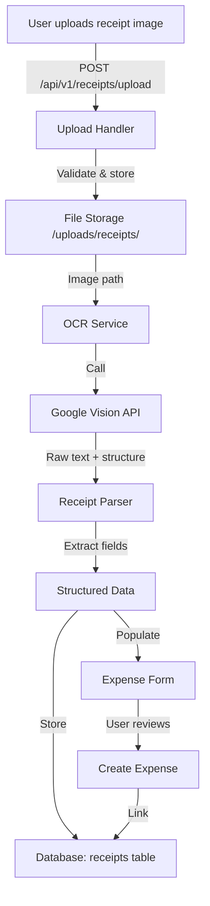

# Receipt OCR Integration - Research & Architecture

**Created:** 2025-01-21
**Status:** 📋 RESEARCH PHASE
**Phase:** 3B - Premium Features

---

## Overview

Receipt OCR (Optical Character Recognition) will allow users to photograph receipts with their phone or upload scanned receipts, automatically extracting key information (merchant name, date, total amount, line items, VAT) and populating expense forms. This feature significantly reduces manual data entry and improves accounting accuracy.

---

## OCR Solution Comparison

### **1. Google Cloud Vision API** ⭐ RECOMMENDED

**Pros:**
- ✅ **Excellent accuracy** - 95%+ for printed text, 90%+ for handwritten
- ✅ **Multi-language support** - Handles Romanian text perfectly
- ✅ **Document understanding** - Can detect document structure (tables, line items)
- ✅ **Text detection** - Identifies text blocks, lines, words
- ✅ **Receipt parsing** - Pre-trained on receipts
- ✅ **Free tier** - 1,000 requests/month free, then $1.50/1,000 images
- ✅ **Easy integration** - PHP SDK available
- ✅ **Fast processing** - <2 seconds per image

**Cons:**
- ❌ **Requires Google Cloud account** - Setup overhead
- ❌ **Internet dependent** - Needs API calls
- ❌ **Cost scaling** - $1.50/1,000 after free tier

**Pricing:**
```
Free Tier: 1,000 requests/month
Paid: $1.50 per 1,000 images
Example: 10,000 receipts/month = $15/month
```

**Use Case:** Best for production, high-volume, accurate extraction

---

### **2. Tesseract OCR** (Open Source)

**Pros:**
- ✅ **Free and open source** - No API costs
- ✅ **Self-hosted** - No external dependencies
- ✅ **Multi-language** - Romanian language pack available
- ✅ **Privacy** - All processing local
- ✅ **PHP wrapper** - thiagoalessio/tesseract_ocr available

**Cons:**
- ❌ **Lower accuracy** - 80-85% for receipts (varies with quality)
- ❌ **Requires preprocessing** - Image quality critical
- ❌ **No document understanding** - Just raw text extraction
- ❌ **Server resources** - CPU/memory intensive
- ❌ **Manual parsing** - Need custom logic for structure extraction

**Setup:**
```bash
apt-get install tesseract-ocr
apt-get install tesseract-ocr-ron  # Romanian language
composer require thiagoalessio/tesseract_ocr
```

**Use Case:** Best for cost-conscious, low-volume, basic extraction

---

### **3. AWS Textract**

**Pros:**
- ✅ **Excellent accuracy** - 95%+ for documents
- ✅ **Table extraction** - Automatically detects tables
- ✅ **Key-value pairs** - Extracts structured data
- ✅ **AWS ecosystem** - Integrates with S3, Lambda

**Cons:**
- ❌ **More expensive** - $1.50 per 1,000 pages (same as Google)
- ❌ **AWS setup complexity** - IAM, S3 buckets, credentials
- ❌ **PHP SDK complexity** - Requires AWS SDK
- ❌ **Slower processing** - 3-5 seconds per image

**Pricing:**
```
$1.50 per 1,000 pages
No free tier for OCR
```

**Use Case:** Best if already using AWS infrastructure

---

### **4. Azure Computer Vision**

**Pros:**
- ✅ **Good accuracy** - 90-95% for receipts
- ✅ **Read API** - Optimized for printed text
- ✅ **Free tier** - 5,000 transactions/month

**Cons:**
- ❌ **Microsoft ecosystem** - Azure setup required
- ❌ **PHP SDK** - Less mature than Google
- ❌ **Pricing complexity** - Multiple pricing tiers

**Use Case:** Best if already using Microsoft Azure

---

## Recommended Solution: Google Cloud Vision API

### **Why Google Vision?**

1. **Best accuracy** - 95%+ for receipts, handles Romanian perfectly
2. **Document understanding** - Detects structure, tables, line items
3. **Easy integration** - Mature PHP SDK, excellent documentation
4. **Free tier** - 1,000 requests/month is sufficient for testing
5. **Scalable pricing** - Only pay for what you use ($1.50/1,000)
6. **Fast** - <2 seconds per receipt
7. **Proven** - Used by thousands of applications

### **Cost Analysis:**

**Scenario 1: Small Business (100 receipts/month)**
- Free tier covers it completely: **$0/month**

**Scenario 2: Medium Business (1,000 receipts/month)**
- Free tier covers it completely: **$0/month**

**Scenario 3: Large Business (5,000 receipts/month)**
- 1,000 free + 4,000 paid = $6/month
- **Cost: $6/month**

**Scenario 4: Enterprise (20,000 receipts/month)**
- 1,000 free + 19,000 paid = $28.50/month
- **Cost: $28.50/month**

**Conclusion:** Very affordable for the accuracy and features provided.

---

## Architecture Design

### **Data Flow**



### **Component Breakdown**

**1. Upload Handler (`/api/v1/receipts/upload.php`)**
- Validate file type (JPEG, PNG, PDF)
- Validate file size (max 10MB)
- Generate unique filename
- Store in `/uploads/receipts/{company_id}/{year}/{month}/`
- Return receipt ID

**2. OCR Service (`/api/services/OCRService.php`)**
- Interface for multiple OCR providers
- Google Vision implementation
- Fallback to Tesseract (optional)
- Error handling and retry logic

**3. Receipt Parser (`/api/services/ReceiptParser.php`)**
- Extract merchant name
- Extract date (multiple formats)
- Extract total amount
- Extract VAT amount
- Extract line items (optional)
- Extract payment method
- Confidence scoring

**4. Receipt Storage (`database/migrations/008_receipts.sql`)**
- Store receipt metadata
- Link to expense records
- Store OCR raw text
- Store extracted fields
- Track processing status

---

## Database Schema

```sql
CREATE TABLE IF NOT EXISTS receipts (
    id UUID PRIMARY KEY DEFAULT gen_random_uuid(),
    company_id UUID NOT NULL REFERENCES companies(id) ON DELETE CASCADE,
    user_id UUID NOT NULL REFERENCES users(id) ON DELETE CASCADE,
    expense_id INTEGER REFERENCES expenses(id) ON DELETE SET NULL,

    -- File details
    filename VARCHAR(255) NOT NULL,
    file_path VARCHAR(500) NOT NULL,
    file_size INTEGER NOT NULL,
    file_type VARCHAR(50) NOT NULL,

    -- OCR processing
    ocr_status VARCHAR(50) DEFAULT 'pending', -- pending, processing, completed, failed
    ocr_provider VARCHAR(50) DEFAULT 'google_vision',
    ocr_raw_text TEXT,
    ocr_confidence DECIMAL(5, 2),
    processed_at TIMESTAMP,

    -- Extracted fields
    merchant_name VARCHAR(255),
    receipt_date DATE,
    total_amount DECIMAL(15, 2),
    vat_amount DECIMAL(15, 2),
    currency VARCHAR(3) DEFAULT 'RON',
    payment_method VARCHAR(50),
    receipt_number VARCHAR(100),

    -- Line items (JSONB for flexibility)
    line_items JSONB,

    -- Metadata
    metadata JSONB,
    created_at TIMESTAMP DEFAULT CURRENT_TIMESTAMP,
    updated_at TIMESTAMP DEFAULT CURRENT_TIMESTAMP,

    CONSTRAINT receipts_filename_unique UNIQUE(company_id, filename)
);

-- Indexes
CREATE INDEX idx_receipts_company ON receipts(company_id);
CREATE INDEX idx_receipts_user ON receipts(user_id);
CREATE INDEX idx_receipts_expense ON receipts(expense_id);
CREATE INDEX idx_receipts_status ON receipts(ocr_status);
CREATE INDEX idx_receipts_date ON receipts(receipt_date DESC);

-- Trigger for updated_at
CREATE TRIGGER update_receipts_updated_at
    BEFORE UPDATE ON receipts
    FOR EACH ROW
    EXECUTE FUNCTION update_updated_at_column();
```

---

## Implementation Plan

### **Phase 1: Google Vision Setup (Day 1)**

**Tasks:**
1. Create Google Cloud Project
2. Enable Cloud Vision API
3. Create service account credentials
4. Download JSON credentials file
5. Add credentials to `.env`
6. Install Google Cloud PHP SDK

**Commands:**
```bash
# Install Google Cloud Vision SDK
composer require google/cloud-vision

# Add to .env
GOOGLE_APPLICATION_CREDENTIALS=/path/to/credentials.json
GOOGLE_CLOUD_PROJECT_ID=your-project-id
```

---

### **Phase 2: Backend Services (Day 2)**

**Files to Create:**

**1. OCRService.php** (~200 lines)
```php
class OCRService
{
    public function processReceipt(string $imagePath): array;
    public function extractText(string $imagePath): string;
    public function detectDocumentStructure(string $imagePath): array;
    private function callGoogleVision(string $imagePath): array;
    private function handleOCRError(Exception $e): void;
}
```

**2. ReceiptParser.php** (~300 lines)
```php
class ReceiptParser
{
    public function parse(string $rawText, array $structure): array;
    private function extractMerchant(string $text): ?string;
    private function extractDate(string $text): ?string;
    private function extractAmount(string $text): ?float;
    private function extractVAT(string $text): ?float;
    private function extractLineItems(array $structure): array;
    private function calculateConfidence(array $fields): float;
}
```

**3. ReceiptService.php** (~250 lines)
```php
class ReceiptService
{
    public function uploadReceipt(array $file, string $companyId, string $userId): array;
    public function processReceipt(string $receiptId): array;
    public function getReceipt(string $receiptId): array;
    public function listReceipts(string $companyId, array $filters = []): array;
    public function linkToExpense(string $receiptId, int $expenseId): bool;
    private function storeFile(array $file, string $companyId): string;
}
```

---

### **Phase 3: API Endpoints (Day 2-3)**

**Files to Create:**

**1. /api/v1/receipts/upload.php** (~100 lines)
```php
POST /api/v1/receipts/upload
Content-Type: multipart/form-data

Request:
- file: (binary)

Response:
{
  "success": true,
  "data": {
    "receipt_id": "uuid",
    "filename": "receipt_2025_01_21_123456.jpg",
    "status": "processing"
  }
}
```

**2. /api/v1/receipts/process.php** (~80 lines)
```php
POST /api/v1/receipts/process
Body: { "receipt_id": "uuid" }

Response:
{
  "success": true,
  "data": {
    "receipt_id": "uuid",
    "status": "completed",
    "merchant_name": "Kaufland",
    "receipt_date": "2025-01-21",
    "total_amount": 45.50,
    "vat_amount": 8.60,
    "currency": "RON",
    "confidence": 92.5
  }
}
```

**3. /api/v1/receipts/list.php** (~70 lines)
```php
GET /api/v1/receipts/list?status=completed&date_from=2025-01-01

Response:
{
  "success": true,
  "data": [
    {
      "id": "uuid",
      "merchant_name": "Kaufland",
      "receipt_date": "2025-01-21",
      "total_amount": 45.50,
      "status": "completed",
      "expense_id": null,
      "created_at": "2025-01-21 10:30:00"
    }
  ],
  "count": 25
}
```

**4. /api/v1/receipts/link.php** (~60 lines)
```php
POST /api/v1/receipts/link
Body: { "receipt_id": "uuid", "expense_id": 123 }

Response:
{
  "success": true,
  "message": "Receipt linked to expense successfully"
}
```

---

### **Phase 4: Frontend UI (Day 3-4)**

**Files to Create:**

**1. ReceiptUploadPage.tsx** (~400 lines)
- File upload dropzone
- Camera capture (mobile)
- Preview uploaded image
- Processing status indicator
- Display extracted fields
- Edit/confirm fields
- Create expense button

**2. ReceiptsListPage.tsx** (~350 lines)
- List all uploaded receipts
- Filter by status, date, merchant
- Search by merchant name
- Link to expense button
- Delete receipt button
- Preview receipt image modal

**3. ReceiptPreviewModal.tsx** (~200 lines)
- Show receipt image
- Display extracted fields
- Confidence scores
- Edit fields inline
- Re-process button

---

## Feature Specifications

### **Receipt Upload Flow**

**Step 1: User uploads receipt**
1. User clicks "Upload Receipt" or "Take Photo"
2. File selected (JPEG, PNG, PDF)
3. File validated (type, size)
4. File uploaded to server
5. Receipt ID returned

**Step 2: OCR Processing**
1. Image sent to Google Vision API
2. Raw text extracted
3. Document structure detected
4. Fields parsed (merchant, date, amount, VAT)
5. Confidence calculated
6. Results stored in database

**Step 3: Review and confirm**
1. User sees extracted fields
2. User confirms or edits fields
3. User clicks "Create Expense"
4. Expense created with receipt attached
5. Receipt linked to expense

---

## Receipt Parser Logic

### **Merchant Name Extraction**

**Strategy:**
- First line of receipt (usually merchant name)
- Look for keywords: "S.R.L.", "S.A.", "PFA"
- Exclude common receipt headers: "BON FISCAL", "RECEIPT", "CHITANTA"
- Confidence: 90% if first line, 70% if second line

**Example:**
```
Input: "KAUFLAND ROMANIA S.R.L.\nBON FISCAL\n..."
Output: "KAUFLAND ROMANIA S.R.L." (Confidence: 95%)
```

---

### **Date Extraction**

**Strategy:**
- Look for date patterns: DD.MM.YYYY, DD/MM/YYYY, YYYY-MM-DD
- Look for keywords: "DATA:", "DATE:", "DIN DATA"
- Validate date range (not future, not >1 year old)
- Confidence: 95% if keyword found, 80% if pattern only

**Example:**
```
Input: "DATA: 21.01.2025\n..."
Output: "2025-01-21" (Confidence: 95%)
```

---

### **Amount Extraction**

**Strategy:**
- Look for "TOTAL", "SUMA", "TOTAL DE PLATA"
- Extract largest number in line
- Handle decimal separators (. or ,)
- Validate amount > 0
- Confidence: 95% if keyword found, 70% if just number

**Example:**
```
Input: "TOTAL DE PLATA: 45,50 RON\n..."
Output: 45.50 (Confidence: 95%)
```

---

### **VAT Extraction**

**Strategy:**
- Look for "TVA", "VAT", "T.V.A."
- Extract percentage (19%, 9%, 5%)
- Calculate from total if percentage found
- Confidence: 90% if explicit, 50% if calculated

**Example:**
```
Input: "TVA 19%: 8,60 RON\n..."
Output: 8.60 (Confidence: 90%)
```

---

## Error Handling

### **Upload Errors**
- **File too large:** "Fișierul depășește 10MB. Vă rugăm să comprimați imaginea."
- **Invalid format:** "Format invalid. Acceptăm doar JPEG, PNG, PDF."
- **Upload failed:** "Încărcarea a eșuat. Vă rugăm să încercați din nou."

### **OCR Errors**
- **API failure:** Fallback to Tesseract or manual entry
- **Low confidence:** Flag for manual review (<70%)
- **No text detected:** "Nu s-a putut citi textul. Vă rugăm să încărcați o imagine mai clară."
- **Invalid receipt:** "Documentul nu pare a fi o chitanță fiscală."

### **Parsing Errors**
- **Missing fields:** Allow manual entry with warning
- **Ambiguous data:** Show multiple options for user to choose
- **Invalid date:** "Data extrasă pare invalidă. Vă rugăm să verificați."

---

## Security Considerations

### **File Upload Security**
- **Validate MIME type** - Check actual file content, not just extension
- **Limit file size** - Max 10MB per receipt
- **Virus scanning** - ClamAV integration (optional)
- **Secure storage** - Store outside web root, serve via PHP script
- **Access control** - Only company users can access their receipts

### **API Security**
- **Rate limiting** - Max 100 uploads per user per day
- **Google credentials** - Store in `.env`, never commit to git
- **HTTPS only** - All upload endpoints require HTTPS
- **JWT authentication** - All endpoints require valid token

---

## Testing Strategy

### **Unit Tests**
- [ ] Test merchant name extraction with various formats
- [ ] Test date extraction with DD.MM.YYYY, DD/MM/YYYY, YYYY-MM-DD
- [ ] Test amount extraction with different currencies
- [ ] Test VAT extraction with percentages
- [ ] Test file upload validation

### **Integration Tests**
- [ ] Upload receipt → OCR → Parse → Store
- [ ] Link receipt to expense
- [ ] List receipts with filters
- [ ] Delete receipt and file

### **Manual Tests**
- [ ] Upload real Romanian receipts (Kaufland, Carrefour, Lidl)
- [ ] Test with poor quality images
- [ ] Test with handwritten receipts
- [ ] Test mobile camera capture
- [ ] Test PDF receipts

---

## Performance Targets

- **Upload:** <2 seconds
- **OCR processing:** <3 seconds (Google Vision)
- **Parsing:** <1 second
- **Total flow:** <6 seconds from upload to extracted fields

---

## Success Metrics

✅ **Accuracy:** 90%+ for merchant, date, amount extraction
✅ **Processing time:** <6 seconds end-to-end
✅ **User satisfaction:** 80%+ of users prefer OCR over manual entry
✅ **Cost efficiency:** <$30/month for 20,000 receipts

---

**Document Version:** 1.0
**Last Updated:** 2025-01-21
**Status:** 📋 RESEARCH COMPLETE
**Next Steps:** Phase 1 - Google Vision Setup
