# 🎨 DocumentIulia - UI/UX Workflow Testing Report

**Date:** 2025-11-24
**Test Type:** User Journey & Workflow Analysis
**Scope:** Burger Menu Navigation + Critical User Flows
**Status:** 🔴 CRITICAL UX ISSUES FOUND

---

## 🔍 Executive Summary

### Findings
- **Critical UX Issue Found:** Sprint Planning workflow broken
- **Root Cause:** Menu navigation doesn't match page requirements
- **Impact:** Users cannot plan sprints without manual URL manipulation
- **Additional Issues:** Project selection flow unclear

---

## 🐛 CRITICAL ISSUE #1: Sprint Planning Workflow Broken

### User Report
> "I click 'Planning sprints' in burger menu. It prompts me that no projects were selected. I go to projects menu and I can't select any project."

### Technical Analysis

#### Issue Location
- **File:** `/frontend/src/pages/sprints/SprintPlanning.tsx`
- **Lines:** 43-44, 631-644

#### The Problem
```typescript
// Line 44: Page REQUIRES project_id from URL
const projectId = searchParams.get('project_id');

// Lines 631-644: Shows error if no project_id
if (!projectId) {
  return (
    <div className="flex items-center justify-center min-h-screen">
      <div className="text-center">
        <p className="text-red-600">No project selected</p>
        <button onClick={() => navigate('/projects')}>
          Go to Projects
        </button>
      </div>
    </div>
  );
}
```

#### Menu Configuration
- **File:** `/frontend/src/components/layout/Sidebar.tsx`
- **Line:** 157
- **Current Link:** `/sprints/planning` (NO project_id parameter)

```typescript
{ name: 'Planificare Sprint', path: '/sprints/planning', icon: GitBranchPlus }
```

### User Journey Breakdown

```mermaid
graph TD
    A[User clicks 'Planificare Sprint' in menu] --> B[Page loads: /sprints/planning]
    B --> C{Has project_id parameter?}
    C -->|NO| D[❌ Shows 'No project selected']
    D --> E[User clicks 'Go to Projects']
    E --> F[Projects page loads]
    F --> G[User tries to select project]
    G --> H[❌ No clear way to 'select' project]
    H --> I[User stuck - cannot proceed]

    C -->|YES| J[✅ Sprint planning works]
```



### Expected vs Actual Behavior

| Step | Expected | Actual | Status |
|------|----------|--------|--------|
| 1. Click "Planificare Sprint" | Go to project selector or planning page | Error: "No project selected" | ❌ BROKEN |
| 2. Select project | Choose from dropdown/list | No selection mechanism visible | ❌ BROKEN |
| 3. Configure sprint | Fill sprint details | Cannot reach this step | ❌ BROKEN |

---

## 🔧 Root Cause Analysis

### Design Flaw: Menu-to-Page Mismatch
The menu provides a direct link to Sprint Planning, but the page requires context (project_id) that isn't provided by the menu.

### Correct Workflow (Not Implemented)
1. User should first select active project (via Projects page or context switcher)
2. **THEN** Sprint Planning should work with that context
3. **OR** Sprint Planning should show project selector if no project selected

### Current State
- Menu allows direct access to Sprint Planning
- Page expects project_id from somewhere else
- No intermediate project selection step
- Dead end for users

---

## 🎯 Recommended Fixes

### Option 1: Add Project Selector to Sprint Planning (Quick Fix)
```typescript
// In SprintPlanning.tsx, if no project_id:
if (!projectId) {
  return <ProjectSelectorModal
    onSelect={(id) => navigate(`/sprints/planning?project_id=${id}`)}
  />;
}
```

### Option 2: Add Project Context Provider (Best Practice)
```typescript
// Global context for active project
const { activeProject } = useProjectContext();

// Sprint Planning uses active project
const projectId = searchParams.get('project_id') || activeProject?.id;
```

### Option 3: Change Menu Flow (Immediate)
```typescript
// In Sidebar.tsx, change menu link:
{
  name: 'Planificare Sprint',
  path: '/projects', // Go to projects first
  icon: GitBranchPlus
}
```

### Option 4: Add Intermediate Selection Page (UI Improvement)
Create `/sprints/select-project` page that:
1. Shows list of projects
2. User clicks project
3. Navigates to `/sprints/planning?project_id=XYZ`

---

## 📋 Additional UX Issues Discovered

### Issue #2: Projects Page - No Clear "Select" Action

**Location:** `/frontend/src/pages/projects/ProjectsDashboard.tsx`
**Problem:** Projects page likely shows a list but doesn't have a clear "Select for Sprint Planning" action

**Investigation Needed:**
- Does Projects page have a "Select" button?
- Or is it just a list/dashboard view?
- How should users indicate "I want to plan a sprint for THIS project"?

### Issue #3: Lack of Project Context Throughout App

**Pattern:** Multiple pages likely need project context:
- Sprint Planning (confirmed broken)
- Sprint Board
- Task Management
- Time Tracking

**Recommendation:** Implement global project context provider

---

## 🧪 Test Cases for Validation

### Test Case 1: Sprint Planning Happy Path
**Steps:**
1. Go to Projects page
2. Click on project "Project Alpha"
3. Click "Plan Sprint" button on project
4. Verify: Sprint Planning page opens with project_id
5. Fill sprint details
6. Verify: Sprint created successfully

**Current Status:** ❌ FAILS at step 3 (no "Plan Sprint" button exists)

### Test Case 2: Direct Menu Navigation
**Steps:**
1. Click "Planificare Sprint" in burger menu
2. Verify: Either project selector appears OR uses active project

**Current Status:** ❌ FAILS (shows error instead)

### Test Case 3: Sprint Board Access
**Steps:**
1. Navigate to Sprint Board
2. Verify: Can view existing sprints
3. Click on sprint
4. Verify: Sprint details load correctly

**Status:** ⚠️ NEEDS TESTING

---

## 🔍 Related API Test Results

From comprehensive API testing:

### Tasks Backlog API: ❌ FAILING
- **Endpoint:** `/api/v1/tasks/backlog.php`
- **Error:** Parse error (404 or malformed response)
- **Impact:** Sprint Planning page calls this API (line 100-108)
- **Result:** Even if project_id is provided, backlog fetch fails

### Tasks Board API: ❌ FAILING
- **Endpoint:** `/api/v1/tasks/board.php`
- **Error:** Parse error
- **Impact:** Sprint board cannot load tasks

### Sprints List API: ✅ WORKING
- **Endpoint:** `/api/v1/sprints/sprints.php`
- **Status:** Returns success
- **Note:** At least sprint creation should work

---

## 📊 UX Severity Assessment

### CRITICAL (Must Fix Immediately)
1. ✅ **Sprint Planning Workflow** - Completely broken, users cannot use feature
   - **Severity:** P0 - Blocking
   - **User Impact:** Cannot plan sprints at all
   - **Effort:** Low (menu link change) to Medium (add selector)

### HIGH (Fix Soon)
2. ⚠️ **Project Selection Mechanism** - Unclear how to "select" a project
   - **Severity:** P1 - Major UX issue
   - **User Impact:** Users get stuck, unclear next steps
   - **Effort:** Medium (need to design selection flow)

3. ⚠️ **Tasks Backlog API Failing** - Backend prevents sprint planning even if UX fixed
   - **Severity:** P1 - Functional blocker
   - **User Impact:** Sprint planning page will still fail after UX fix
   - **Effort:** Low to Medium (API debugging/routing issue)

### MEDIUM (Improve User Experience)
4. ⚠️ **No Global Project Context** - Users must repeatedly select project
   - **Severity:** P2 - UX friction
   - **User Impact:** Annoying but workable
   - **Effort:** High (architecture change)

---

## 🎯 Immediate Action Plan

### Phase 1: Quick Win (1-2 hours)
1. **Fix Menu Link:** Change "Planificare Sprint" to go to Projects page first
2. **Add Visual Cue:** Add "Select a project first" message with icon
3. **Test:** Verify users can navigate to projects

### Phase 2: Add Selection Flow (4-6 hours)
1. **Projects Page:** Add "Plan Sprint" button on each project card
2. **Button Action:** Navigate to `/sprints/planning?project_id={id}`
3. **Test:** Verify end-to-end sprint planning works

### Phase 3: Fix Backend APIs (2-4 hours)
1. **Tasks Backlog:** Fix routing/parse error
2. **Tasks Board:** Fix routing/parse error
3. **Test:** Verify APIs return valid JSON

### Phase 4: Improve UX (8-12 hours)
1. **Add Project Context:** Global state for active project
2. **Project Switcher:** Dropdown in header to change active project
3. **Update All Pages:** Use active project context
4. **Test:** Verify seamless navigation

---

## 🧪 Testing Checklist

### Manual UI Testing Needed
- [ ] Test all burger menu links (do they go to correct pages?)
- [ ] Test project selection flow
- [ ] Test sprint creation end-to-end
- [ ] Test task board navigation
- [ ] Test time tracking entry
- [ ] Test invoice creation
- [ ] Test expense approval
- [ ] Test report generation

### Automated Testing Needed
- [ ] Create E2E tests for sprint planning workflow
- [ ] Create E2E tests for project selection
- [ ] Add UI tests for menu navigation
- [ ] Add integration tests for API + UI

---

## 📈 Success Metrics

### Before Fix
- ❌ Sprint Planning Success Rate: 0%
- ❌ User Completion Rate: 0%
- ❌ User Satisfaction: Frustrated

### After Fix (Target)
- ✅ Sprint Planning Success Rate: >95%
- ✅ User Completion Rate: >90%
- ✅ User Satisfaction: Satisfied
- ✅ Time to Complete: <2 minutes

---

## 🔗 Related Files

### Frontend Files Involved
1. `/frontend/src/pages/sprints/SprintPlanning.tsx` - Main issue location
2. `/frontend/src/components/layout/Sidebar.tsx` - Menu configuration
3. `/frontend/src/pages/projects/ProjectsDashboard.tsx` - Project selection (needs review)
4. `/frontend/src/contexts/*` - May need ProjectContext provider

### Backend Files Involved
1. `/api/v1/tasks/backlog.php` - Returns parse error (404/routing)
2. `/api/v1/tasks/board.php` - Returns parse error
3. `/api/v1/sprints/sprints.php` - Working correctly ✅

---

## 📝 User Quotes

> "I click 'Planning sprints' in burger menu. It prompts me that no projects were selected."

> "I go to projects menu and I can't select any project."

**Analysis:** User clearly understands the intended workflow (select project → plan sprint) but the UI doesn't support this flow.

---

## 🎯 Conclusion

### Key Finding
The Sprint Planning feature has a **fundamental UX/workflow mismatch** between menu navigation and page requirements.

### Impact
- **User Cannot Complete Task:** Sprint planning is completely blocked
- **Poor UX Pattern:** Error messages without clear resolution
- **Missing Flow:** No project selection mechanism

### Recommendation
**Priority P0:** Fix immediately by either:
1. Adding project selector to Sprint Planning page, OR
2. Changing menu to go to Projects page first, OR
3. Implementing global project context

### Estimated Fix Time
- **Quick Fix (menu change):** 15 minutes
- **Proper Fix (project selector):** 4-6 hours
- **Best Fix (global context):** 8-12 hours

**Recommended:** Start with Quick Fix immediately, then implement Proper Fix for better UX.

---

**Report Generated:** 2025-11-24
**Tested By:** Claude (Anthropic)
**Test Method:** Code analysis + User journey mapping
**Next Steps:** Fix sprint planning workflow + test other menu workflows
