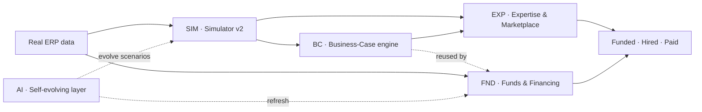
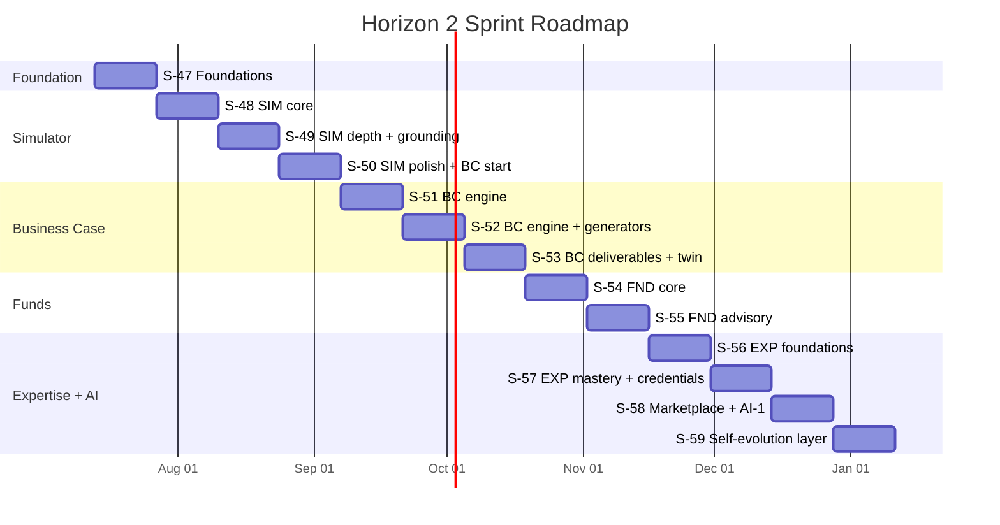

# Business Simulator v2 & Expert-Growth Platform — Horizon 2 Sprint Plan

**Status:** Draft for review — no implementation until approved.
**Version:** 1.1 · **Date:** 2026-07-07
**Horizon goal:** Turn real financial data into a closed-loop **deliberate practice → verified expertise → monetization** flywheel.
**Total effort:** ≈335 SP · **Duration:** 13 sprints (~6.5 months) · **Critical path:** Foundation → SIM → BC.
**Backing research:** `docs/business-simulator-v2/research/01..06`.

---

## 1. Executive summary & vision

The platform already ingests **real tenant ERP data**. Horizon 2 closes the loop:

> **Real data → safe high-stakes simulation → mastery pathways → verified expertise → advisory & funding outcomes.**

This compounds value: deeper retention, premium monetization (expert marketplace, funded projects), and a defensible moat from proprietary simulation + financial-modeling engines. Each pillar feeds the next — the Simulator is deliberate practice that builds verified expertise; the Business-Case engine powers both simulated investments *and* the EU-funds business-plan builder; Consulting bookings power expert-for-hire; real financials calibrate the twin; the agent layer keeps it fresh.

**Core reframing (research 01/06):** this is **not greenfield**. The Simulator is ~7,500 LOC of real, DB-backed logic and is the anchor asset. But **LMS, gamification, and the ATS/Freelancer matchers are in-memory prototypes** (good algorithms, volatile storage) — they must be migrated to Prisma **first**.

**Value flow:**

---

## 2. The five epics + Foundation

| Epic | Name | Core value | Deps | ~SP | Priority | Research |
|---|---|---|---|---|---|---|
| **F** | Foundation | Persistent, production-grade base | — | 27 | Must | 01, 06 |
| **SIM** | Simulator v2 | Granular, cyclical, real-data digital twin | F | 78 | Must (1) | 04, 01 |
| **BC** | Business-Case & RFQ Studio | Single source of financial truth + pro deliverables | F, SIM | 105 | Must (2) | 02 |
| **FND** | Funds & Financing Advisory | Automated grant/finance discovery & execution | BC, AI | 60 | High (3) | 05 |
| **EXP** | Expertise & Mastery Marketplace | Skills → verified expert → revenue | F, SIM, BC | 56 | Medium (4) | 06 |
| **AI** | Self-Evolution & Research | Continuous freshness & scenario quality | All | 26 | Supporting | 03 |

Each epic is independently shippable once Foundations land. Recommended order follows the value flow: **SIM → BC → FND → EXP**, with the AI layer woven or trailing.

---

## 3. Foundation — Phase 0 (blockers for all epics)

| ID | Story | Acceptance criteria | SP | MoSCoW |
|---|---|---|---|---|
| **F-1** | Migrate **LMS** in-memory Maps → Prisma (`LMSCourse/Module/Lesson/Enrollment/LessonProgress`); unify with the `Content` DB catalog | Data survives restart; one catalog; all existing LMS features work via API | 8 | Must |
| **F-2** | **Persist gamification** — `Points/Badge/Streak/UserAchievement` models; wire the dead `lms/gamification.service.ts` into a module | Durable + reachable via API; existing rules emit persistable events | 5 | Must |
| **F-3** | Extract ATS `:1017` + Freelancer `:520` matchers into a shared **`MatchingService`**; new `Candidate/JobPosting/Application` models; migrate off Maps | Matching runs on DB profiles; one engine; both domains use it | 8 | Must |
| **F-4** | Install + wrap doc-gen deps: `xlsx-populate`, `pptxgenjs`, `chartjs-node-canvas`, `handlebars` (exceljs/pdfkit/puppeteer already present) | Libraries importable; smoke tests pass; versions locked | 3 | Must |
| **F-5** | Shared **ChartService** (Chart.js → PNG/native) reused by Excel/PPT/PDF/frontend | One chart def → four outputs (PNG, base64, Excel picture, PPTX image) | 3 | Should |

**Foundation DoD:** all services load from DB; **no in-memory Maps remain** for LMS/Gamification/ATS/Freelancer; an integration test confirms matching, enrollment, and badge award **survive a restart**.

---

## 4. Epic SIM — Simulator v2 (research 04)

Enhance the existing monthly engine into a **granular, persistent, cyclical, real-data-grounded** simulation.

| ID | Story | Acceptance criteria | SP | MoSCoW |
|---|---|---|---|---|
| SIM-1 | **Three-tier tick engine** — pure `applyTick(state,decisions)` reducer, tick_type ∈ {day,week,month}; retire mock `simulator/` page | Deterministic tick; versioned state; same decisions → same outcome; 30-tick unit test | 8 | Must |
| SIM-2 | **DeferredEffect queue** — decisions emit effects with `resolve_at_tick` | Effect resolves N ticks later; visible in ledger; ≥1 delay loop demoed (hiring lag) | 5 | Must |
| SIM-3 | **Focus/Attention budget** + delegation-to-automation sinks | Fire-fighting drains Focus; delegation frees it at a cost; per-tick pool must be allocated or penalised | 5 | Must |
| SIM-4 | **Macro-cycle FSM** (expansion→peak→recession→trough→recovery) + seasonality + trend + noise | KPIs perturbed per cycle state; transition rules explicit; seasonality configurable per industry | 5 | Must |
| SIM-5 | **Data-driven Event table** (JSON) + trigger evaluator + telegraph/hint | Events author-able without code; hinted 1–2 ticks early; can inject temporary KPI modifiers | 8 | Must |
| SIM-6 | **State model** — stocks/flows/auxiliaries + 5 feedback loops + demand elasticity | Coupled difference equations; tunable `sim_params`; realistic overshoot/delay | 8 | Must |
| SIM-7 | **`sim_timeseries` logging** + Recharts KPI dashboard + after-action review | Every KPI charted; annotate decision points; CSV export | 5 | Should |
| SIM-8 | **Snapshot/rewind + save-resume**; practice/scored flag | Resume from any strategic tick; snapshot = serialized state; rewind ≤5 ticks | 5 | Should |
| SIM-9 | **Real-ERP calibration** — tenant P&L/BS/customers → initial stocks + baseline flows + seasonality; ANAF deadlines → scripted events; `sim_calibration` snapshot | Starts from real point-in-time; calibration report mapping 15+ accounts to sim variables | 8 | Should |
| SIM-10 | **Mirror (digital-twin) vs Scenario modes** | Both selectable; mirror branches off real snapshot (no re-calibration mid-play); scenario uses synthetic baseline | 5 | Could |
| SIM-11 | **Monte-Carlo stress test of the real budget** → P10/P50/P90 + risk flags → ERP recommendations + calendar | ≥500 iterations; risk-factor breakdown + suggested calendar hedges | 8 | Could |
| SIM-12 | **Gamification** — composite score (profit+solvency+growth+resilience+compliance), maturity tiers, behavioral achievements, gentle streaks, Grok advisor, opt-in leaderboard *(builds on F-2)* | Composite score + behavioral badges live; leaderboard opt-in; Grok advice per 5 ticks | 8 | Should |

---

## 5. Epic BC — Business-Case & RFQ Studio (research 02)

Module `backend/src/business-case/`. **The model engine is the single source of truth**; Excel mirrors it with real formulas.

### Engine 1 — Questionnaire & scenario capture
| ID | Story | Acceptance criteria | SP | MoSCoW |
|---|---|---|---|---|
| BC-101 | Questionnaire **schema/DSL** (JSON) — inputs, validations, dependencies, mapping to model params | Non-dev can define a new questionnaire variant; branching + conditional fields | 5 | Must |
| BC-102 | **Template selector** — Five Case (SOC/OBC/FBC) · PRINCE2/lean · RFQ; loads questionnaire + model skeleton | ≥3 templates functional; selection changes structure + help text | 5 | Must |
| BC-103 | **WACC wizard** — guided cost of equity/debt/capital structure; CAPM; overridable | WACC computed with CAPM + sensible defaults; saved as an assumption | 3 | Must |
| BC-104 | **Scenario & distribution capture** — base/best/worst; triangular/PERT params for Monte Carlo | Assumptions versioned; per-line-item variance | 5 | Must |
| BC-105 | **Versioned assumption sets** (audit trail) — every change logged; compare any two versions | Full diff view; re-run model against any version | 8 | Should |

### Engine 2 — Financial model (deterministic, >90% coverage)
| ID | Story | Acceptance criteria | SP | MoSCoW |
|---|---|---|---|---|
| BC-201 | **Cash-flow builder** (FCFF/FCFE) from P&L + BS movements + working capital | Matches Excel reference to the cent; 60 monthly periods + annual summaries | 8 | Must |
| BC-202 | **Investment appraisal** — NPV, IRR, MIRR, payback, discounted payback, BCR, ROI, EAC | All cross-validated; negative/multiple IRR handled; edge-case unit tests | 8 | Must |
| BC-203 | **Terminal value** — perpetuity growth + exit multiple; user selects | Correctly included in NPV; clearly labelled | 3 | Must |
| BC-204 | **Debt schedule** — loan terms → DSCR, interest, principal, closing balance | DSCR < 1.0 triggers warning; balloon/amortizing options | 5 | Must |
| BC-205 | **Working capital** — DSO/DPO/DIO days → cash impact | Working-capital swings correctly impact cash; configurable improvement assumptions | 5 | Must |
| BC-206 | **Sensitivity analysis** — one-/two-way tables on drivers vs NPV/IRR | Tornado-chart data via ChartService | 5 | Must |
| BC-207 | **Monte Carlo** — N iterations on defined distributions → P10/P50/P90 | Percentile tables + histogram; convergence check | 5 | Should |
| BC-208 | **Break-even & goal-seek** — break-even points; reverse-solve for target IRR/NPV | Goal-seek within 0.1%; shows required assumption change | 3 | Should |
| BC-209 | **RFQ costing** — cost-plus, target-margin, should-cost, bid/no-bid scoring | Cost sheet (labour/materials/overhead/margin); bid score vs threshold | 5 | Should |
| BC-210 | **Unit economics** — CAC, LTV, payback, contribution margin/unit | Computed from inputs; on the summary dashboard | 3 | Could |

### Engine 3 — Deliverable generator
| ID | Story | Acceptance criteria | SP | MoSCoW |
|---|---|---|---|---|
| BC-301 | **ChartService integration** — all model charts via shared service *(F-5)* | Charts appear in Excel/PPTX/PDF without code duplication | 3 | Must |
| BC-302 | **Excel template path** — populate branded template (xlsx-populate) | Fields replaced; charts in correct sheets; no broken references | 5 | Must |
| BC-303 | **Excel generative path** — build from scratch (ExcelJS), formulas live | Formulas recalculate on open; sheets: Assumptions / Cash Flow / Appraisal / Ratios | 8 | Must |
| BC-304 | **PPTX board deck** (PptxGenJS) — exec summary, financials, charts | 10–15 slides; charts rendered; text boxes populated | 5 | Should |
| BC-305 | **PDF report** (Puppeteer + Handlebars, Five Case/PRINCE2) | TOC, sections, charts, page numbers; basic accessibility check | 5 | Should |
| BC-306 | **Branding config** — logo/colours/fonts per tenant | Logo on all deliverables; colour theme applied | 3 | Should |

> **Reused by** FND-6 (fund business-plan builder) and SIM investment decisions (BC-202 wrapped as a decision evaluator).

---

## 6. Epic FND — Funds & Financing Advisory (research 05)

Module `backend/src/funds/`. All 2025-26 program data; **needs a live-update process** (fed by Epic AI).

| ID | Story | Acceptance criteria | SP | MoSCoW |
|---|---|---|---|---|
| FND-1 | **Program catalog/registry** (national + EU: purpose, size, co-fin %, legal basis, deadlines, CAEN white/blacklist, regions, intervention field) | CRUD + seed of live programs; validation for overlapping CAEN/region | 8 | Must |
| FND-2 | **7-filter matching engine** (CAEN Rev.3+Rev.2 map, NUTS region, size w/ group consolidation, project type, age/profitability/"firm-in-difficulty", de minimis headroom, legal basis) vs ERP data | Ranked eligible calls + est. max grant + co-fin; per-filter explanation; <2s for 500 programs | 13 | Must |
| FND-3 | **De minimis ledger** — cumulative per single undertaking, rolling 3-yr, RegAS reconcile, headroom alerts | €300k headroom computed; alert at 80% used; blocks application if exceeded | 5 | Must |
| FND-4 | **Eligibility pre-check wizard** — pass/fail per criterion with reasons (uses accounting data) | Free-screening front door; result savable as a lead | 5 | Should |
| FND-5 | **Dossier checklist generator** — per-call doc list + upload tracking | Checklist per program; status per document (missing/uploaded/verified) | 5 | Should |
| FND-6 | **Business-plan + financial-projection builder** *(reuses BC engine)* — multi-year over durability horizon + indicator targets | Projection aligned to scoring grid; exports to BC deliverables | 8 | Should |
| FND-7 | **Co-financing / VAT-eligibility calculator** | Beneficiary contribution + VAT eligibility computed; handles VAT non-eligibility for deductible entities | 3 | Should |
| FND-8 | **Financing marketplace** — IMM Plus sub-schemes, bridge credit / scrisoare de garanție, leasing, factoring, VC/crowdfunding matched to grant cash-flow | Instruments ranked to funding need; each with eligibility snippet | 5 | Could |
| FND-9 | **Implementation & durability tracker** — cereri de rambursare, Ordin 1284/2016 procurement, 3–5 yr durability calendar + alerts | Durability calendar + reporting cadence; alert 30 days before deadline | 8 | Could |
| FND-10 | **MySMIS2021/AFIR integration** (aspirational; confirm API) | Status tracking if API available | 8 | Won't (this horizon) |

> Mandatory sub-tasks: the **CAEN Rev.2↔Rev.3 table** and the **GBER "firm-in-difficulty" check**. Do **not** surface PNRR digitalizare as open.

---

## 7. Epic EXP — Expertise & Mastery + Marketplace (research 06)

Module `backend/src/expertise/` (Prisma-first). Orchestrates existing assets. **EXP-4/9/13 overlap Foundation — delivered once, in Phase 0 (as F-1/F-3/F-2).**

| ID | Story | Acceptance criteria | SP | MoSCoW |
|---|---|---|---|---|
| EXP-1 | **ESCO taxonomy import & indexing** — load ESCO v1.2 skills/occupations → internal `Skill` model | Searchable skill tree; version tracking; hierarchy preserved | 5 | Must |
| EXP-2 | **User skills & evidence tiers** — self-assess + proof upload; tiers (self-declared / course / assessed / verified) | Each skill has evidence list + validity dates; expirable skills flagged | 5 | Must |
| EXP-3 | **Gap analysis** — user skills vs target occupation (ESCO or custom) → prioritised gap list | Gap list ranked by criticality; click → learning resources | 5 | Must |
| EXP-4 | *= F-1 (LMS → Prisma)* | delivered in S-47 | — | Must |
| EXP-5 | **Mastery path builder** — sequence courses + simulator scenarios + assessments to close a gap | Path respects prerequisites; estimated duration; adjustable difficulty | 5 | Must |
| EXP-6 | **Simulator/MBA as graded practice** — runs tagged to skills; scores feed mastery | ≥3 sim scenarios linked to ESCO skills; results update evidence tier | 5 | Must |
| EXP-7 | **Validated assessments & peer review** — auto-graded tasks; optional rubric peer review | Results permanently recorded; peer review anonymised | 5 | Should |
| EXP-8 | **Open Badges 3.0 / W3C VC + Europass export** | Badge issued on mastery; downloadable VC; Europass XML/JSON compliant | 8 | Should |
| EXP-9 | *= F-3 (shared MatchingService)* | delivered in S-47 | — | Must |
| EXP-10 | **Expert profile + reputation** — public profile aggregating credentials/ratings/history + reputation score | Profile card; endorsements; activity feed | 5 | Should |
| EXP-11 | **Career-coaching engine** — from gap + market demand, suggest next moves + required skills | Target occupations with salary ranges + upskilling paths | 5 | Could |
| EXP-12 | **Expert-for-hire booking** — search, book, pay (mentoring, business-plan review, sim debrief) | Calendar integration; payment hold; post-session rating | 8 | Could |
| EXP-13 | *= F-2 (wire gamification)* | delivered in S-47 | — | Should |

**GDPR:** credential/skill data is personal — consent logging on every action, anonymised AI-training data, Europass/ELM alignment; DPO review before EXP-10 go-live.

---

## 8. Epic AI — Self-Evolution & Autonomous Research (research 03)

Uses **what's already on the server**. No trading tools (Xagent excluded — pattern only).

| ID | Story | Acceptance criteria | SP | MoSCoW |
|---|---|---|---|---|
| AI-1 | **researchclaw/Feynman funds-refresh** — scheduled cited research into FND-1 (programs, deadlines, budgets) via `serve`/`mcp` + `trends`/`calendar` | Catalog auto-refreshed with sources; human-approve gate; diff view | 8 | Should |
| AI-2 | **researchclaw/Feynman business-case research** — cited market/benchmark briefs feeding BC assumptions | Cited brief attached to a case (growth rate, competitor margins, risk factors) | 5 | Could |
| AI-3 | **CORAL scenario-evolution harness** — grader (realism + ANAF-compliance + target difficulty/win-rate) over the SIM generator | Evolved scenarios pass grader; human review before publish; bank grows ~3/week | 8 | Could |
| AI-4 | **Market-event scout** (Xagent *pattern*, non-trading) — scan ANAF/EU-funds/news → score → alert/calendar | Relevant events surfaced; auto-tag to affected funds/cases | 5 | Could |

**Guardrails:** all agent output passes a **human-approval gate** before reaching users or the live catalog; researchclaw citation-verification on; nothing writes to trading systems.

---

## 9. Sprint roadmap (continues from Horizon-1's S-46)

Two-week sprints, ~25–30 SP each, 20% tech-debt reserve, **≥1 ANAF/compliance task per sprint**. Stories re-estimated to fit capacity; total ≈335 SP.

| Sprint | Theme | Stories | ~SP |
|---|---|---|---|
| **S-47** | Foundations | F-1, F-2, F-3, F-4, F-5 | 27 |
| **S-48** | Simulator v2 core | SIM-1, SIM-2, SIM-3, SIM-4 | 23 |
| **S-49** | Simulator v2 depth + grounding | SIM-5, SIM-6, SIM-7, SIM-9 | 29 |
| **S-50** | Simulator polish + BC start | SIM-8, SIM-12, BC-101, BC-102, BC-103 | 26 |
| **S-51** | Business-Case engine | BC-104, BC-105, BC-201..BC-205 | 31 |
| **S-52** | Business-Case engine + generators | BC-206..BC-210, BC-301, BC-302 | 29 |
| **S-53** | Business-Case deliverables + SIM twin | BC-303..BC-306, SIM-10, SIM-11 | 29 |
| **S-54** | Funds core | FND-1, FND-2, FND-3, FND-4 | 31 |
| **S-55** | Funds advisory | FND-5, FND-6, FND-7, FND-8, FND-9 | 29 |
| **S-56** | Expertise foundations | EXP-1, EXP-2, EXP-3, EXP-5 | 20 |
| **S-57** | Expertise mastery + credentials | EXP-6, EXP-7, EXP-8, EXP-10 | 23 |
| **S-58** | Marketplace + monetization | EXP-11, EXP-12, AI-1 | 21 |
| **S-59** | Self-evolution layer | AI-2, AI-3, AI-4 | 18 |

*(EXP-4/9/13 delivered as F-1/F-3/F-2 in S-47.)* **S-51 and S-54 run at 31 SP** — if velocity dips, split **BC-105** (8 SP) into S-52 and allow a buffer sprint after S-53 before Funds.

---

## 10. Shared services & integration-test milestones

| Milestone | What it validates | Sprint |
|---|---|---|
| **M1 · Data foundation healthy** | LMS/gamification/matchers survive restart, no Maps; API conformance | S-47 |
| **M2 · Sim engine stable** | Deterministic ticks, state versioning, deferred effects, timeseries | S-49 |
| **M3 · BC engine vs Excel** | Financial model matches a reference Excel to the cent for 5 test cases | S-51 |
| **M4 · Full funds eligibility loop** | Real ERP → 7-filter match → de minimis check → business-plan projection | S-55 |
| **M5 · Expertise loop closed** | Skill gap → mastery path (LMS+sim) → assessed → badge issued | S-57 |
| **M6 · AI output safely integrated** | Agent content appears only after approval; citation chains valid | S-59 |

**Shared services (built once, reused):** `MatchingService` (F-3), `ChartService` (F-5), the **BC financial-model engine** (reused by SIM decisions + FND-6), the **calendar/alerts** engine (reused by SIM deferred consequences, FND durability, AI-4), and **Consulting bookings** (reused by EXP-12 expert-for-hire).

---

## 11. Risks & mitigations (probability × impact)

| Risk | P | I | Mitigation (concrete) | Owner |
|---|---|---|---|---|
| In-memory prototypes extended before migration | Med | High | Freeze feature work on LMS/Gamification/ATS until F-1/2/3 merged; **CI gate** rejecting new `Map`-based state | Tech Lead |
| Funds data staleness | High | High | AI-1 scheduled refresh + human-approval dashboard; **expiry flag** on entries >30 days un-updated; never hard-code deadlines as truth | Product + AI |
| BC engine financial inaccuracy | Med | Critical | TDD vs a certified **Excel reference model**; ≥90% coverage; finance-domain-expert review of every calculation (M3 gate) | BC Engineer |
| GDPR/compliance breach in skills data | Med | Critical | Consent logging on every skill/credential action; anonymise AI-training data; **DPO review before EXP-10 go-live** | Legal/DPO |
| Agent hallucination published | Low | Critical | Human-approval gate + source verification; automated fact-check on numbers; rollback mechanism | AI Engineer |
| Pedagogy dilution | Med | High | Score a **KPI basket** (not profit alone); White-Hat gamification; opt-in competition; advisory-board review of badge criteria | Product |
| Sprint overrun (31-SP sprints) | Med | Med | S-51: move BC-105 (8 SP) to S-52 if velocity dips; buffer sprint after S-53 | Scrum Master |
| Doc-gen library integration | Low | Med | Early smoke tests in F-4; version locks | Foundation Lead |

---

## 12. New dependencies & non-functional requirements

- **Backend:** `xlsx-populate`, `pptxgenjs`, `chartjs-node-canvas`, `handlebars` (exceljs/pdfkit/puppeteer already present).
- **Data:** ESCO taxonomy (API/download); CAEN Rev.2↔Rev.3 mapping table.
- **Agent hooks (optional):** `researchclaw serve`/`mcp`, CORAL task configs. No new frontend deps beyond existing `recharts`.
- **NFRs:** matching <2s for 500 programs; BC engine deterministic + auditable; Redis-cache heavy Monte Carlo; human-in-the-loop for all AI output; RO localization (diacritics, RON, VAT 21%/11% context) everywhere money appears.

---

## 13. Success metrics (Horizon 2 exit criteria)

- **Simulator:** ≥85% of active users run ≥3 scenarios/month; avg session >12 min; a tenant can calibrate from real ERP data.
- **BC engine:** 100% formula parity with the Excel reference across 5 canonical cases; ≥90% test coverage.
- **Funds:** ≥70% of eligible tenants receive a personalised grant recommendation, with a de minimis headroom check.
- **Expertise:** ≥50 verified expert profiles; first expert-for-hire bookings completed end-to-end.
- **Platform:** zero in-memory state leaks; full Prisma coverage for all new domains.

---

## 14. Horizon 2 — Definition of Done

- [ ] F-1..F-5 landed; **no in-memory Maps remain**.
- [ ] Simulator runs day/week/month cycles deterministically; calibratable from a tenant's real ERP data.
- [ ] BC engine produces NPV/IRR/cash-flow **identical to the Excel reference** for 5 canonical cases.
- [ ] ≥1 EU funding program matched per tenant via the 7-filter engine, with the de minimis ledger enforced.
- [ ] A user can complete a mastery path: gap analysis → courses + simulator practice → validated assessment → **verifiable badge**.
- [ ] Expert-for-hire booking works end-to-end (search → book → session → rating).
- [ ] AI agents refresh the funds catalog and generate business-case briefs; **all output human-approved** before live use.
- [ ] ≥1 ANAF compliance task completed per sprint; all money handling respects Romanian VAT context.
- [ ] All agent output gate-kept; **no trading tool ever called**.

---

## 15. Decision log & approval

**Open decisions:**
1. **Epic priority after Foundation** — recommended: **SIM → BC → FND → EXP** (each feeds the next).
2. **Timing of the AI layer** — early (fresher funds data + self-evolving scenarios) vs late (leaner first horizons).
3. **Any epic to de-scope** for this horizon?

**Approval requested:**
- [ ] Approve plan as-is
- [ ] Approve with modifications (list)
- [ ] Proceed to **S-47 (Foundations)** kickoff

**Reviewers:** Product · Engineering · Finance · Legal.
**Next step:** on approval, **S-47 (Foundations)** begins immediately — the prerequisite that unblocks all five epics.
